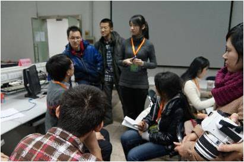
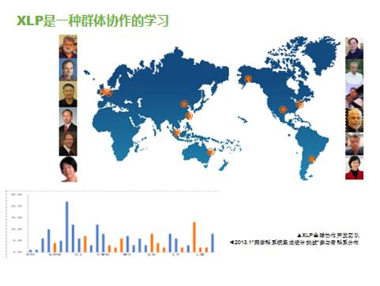
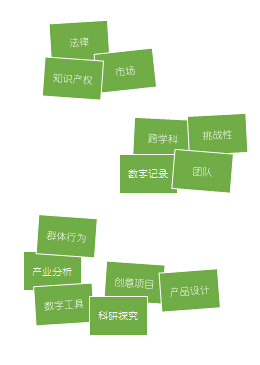
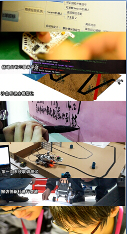
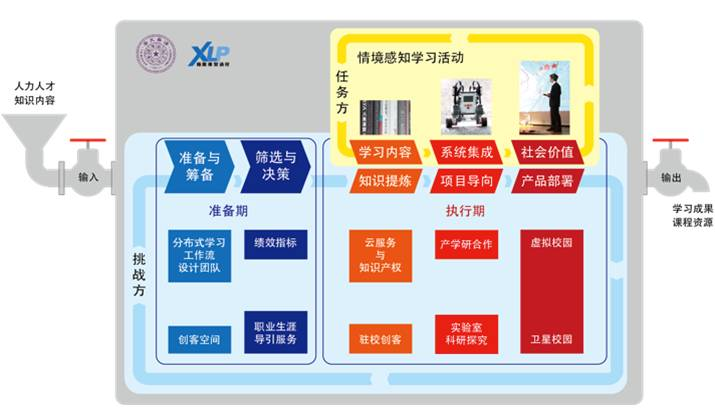

## What is XLP

* XLP是基于知识社会化，社会信息化，信息数据化的社会宏观背景下， 通过合约化群体协作，融合信息技术与实体校园，积累与创造群体认知能力的学习活动。

▲2013年1月清华大学跨学科系统集成设计挑战4天XLP中的挑战方与任务方

网络化、大数据的时代之下，我们认为，个人所能掌握的知识，必须要与更大规模的群体知识连接。

▲2013年1月清华大学跨学科系统集成设计挑战4天XLP中的挑战方与任务方

从2012年以来，XLP已在全球范围、跨越多种专业领域协同了多方的合作者与合作团队。

* XLP是极限学习过程的英文简称。是一个基于分布式工作流的群体学习活动的设计方法论。它提出一套分布而不分散的工作轨范，引导多种具备各种不同专业技能的参与人员，利用分布式的信息交换架构，组织学习的任务。这个工作轨范可以被比喻为一个多人多机的分布式操作系统，让各种显性与隐性的知识内容，可以持续地积累在一个网络化的人群系统之内。它把规划组织化学习的工作分成5个阶段：   

	1. 探索并设定学习目标 
	2. 学习资源与时程的安排 
	3. 数字化与网络化的协作数据与内容的管理 
	4. 学习内容的体验与学习成果的开发 
	5. 展现学习成果，总结并比较学习成效 

这五个基本的阶段，各有不同性质的学习活动，配合不同的信息采集工具，让参与学习活动的群体，能够并发而有序地贡献自己的才智，把自己的学习经历与成果，不断地以数字化的内容，累积到一个可以规模化共享的信息内容管理系统。这套方法论，提出了一些自组织系统的工作轨范，让参与学习者，可以依照这些工作轨范，调度参与者的才能，解决一些或许从未被解决过的问题。在产出学习成果之后，还提出了一个工作程序，引导参与者把学习成果以一种可传播的方式，记录并发表。这个学习工作流的信息架构，必须稳固地建筑在一套通用的数据采集与信息内容分类的标准，尽可能让各种团队或个人的知识内容，能够经由一个约定成俗的信息分类法，提高分享内容，查找内容的效率。当有大量的数字化内容的积累效应之后，许多的内容可以基于这些通用的约定，让大量的人脑，或是机械化的计算过程，能够不断地为后人总结前面所积累的学习内容。这个愿景，就是”极限学习过程"规划各类网络化组织，探索新知识的一个运行的框架。

我们发现学习的效果，特别是群体化学习的效能受到很多不同因素的影响。所以XLP的理论基础来自几个不同的来源，从宪法学专家所阐述的驱动群体行为的四种互补的力量，认知科学强调的”游戏化学习方法“(Learning Gamification)，计算科学家所描述的“基于合约的设计”(Design by Contract), 以及软件开发团队所倡导的”极限编程“工作方式。

* 一种跨学科、跨越时空管理学习资源的策略  
例如，在学习过程中，学习工具的特性，将决定开展特别的学习行为的可能性。好比学习物联网的技术，特别需要让学生能接触到开源硬件与廉价的单片机的实验器材。而团队工作所可能发生的各种潜在冲突，尤其是在大规模的网络化协作所可能发生的内容复制权或是署名先后顺序的争执，都需要有专门的工作协议来调解。而学习过程中的经常性反馈，以动态地积分反馈或是类似市场货币交易的方式，可以从认知机制提升参与者不断地修正个人与团队的学习兴趣。没有这些教学内容，规模化的网络化学习与知识分享，将有各种不同的障碍。  
我们也发现，如何明确地列举、分析、整理工作目标的陈述与工作成果的检验方式，可以利用Design by Contract以及先开发测试条件或是测试案例的工作原则来降低团队成员迷失工作方向的机率。而这些工具或是方法都已经有广而深的知识内容与相应的工具，但是把它们放到一个相互呼应的学习环境，却需要特别多的前期开发与大量的人力。  
所以XLP的运行策略就是把学习者，或是所有的XLP参与者，都经由数字化与网络化的工具，让它们在多次活动的过程中，不断地累积集成这些方法与操作性工具的成果。让具有共性的学习机制，在不同地区、不同时段所发生的学习活动中，用一套分布式的数据／信息内容管理工具来迭代化地整理。换言之，我们也可以想像XLP是一个跨越专业学科，跨越时空调度知识内容与学习经验的资源管理策略。

  
►2013年1月清华大学跨学科系统集成设计挑战XLP活动  

我们把这些理论知识的内容，融化到操作性的工作过程中。让参与者经由相关领域的特定工作模式或是专用的工具，从实践的体验进程，掌握群体化学习的理论知识。这一本操作手册，会提供一些理论知识的参考内容，但是不会深入地解释各种学习方法论的理论框架。这些内容，会以参考文献的方式，列举在各章节或是书本之后。

 
