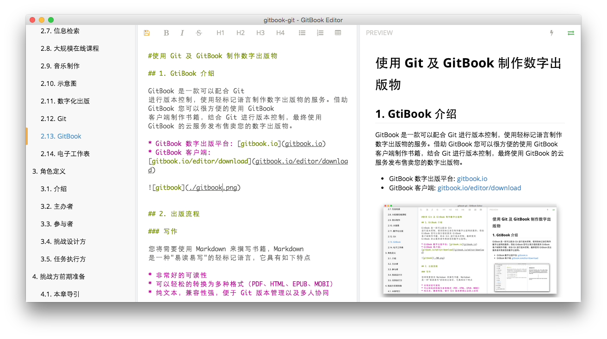

#使用 Git 及 GitBook 制作数字出版物

## 1. GtiBook 介绍

GitBook 是一款可以配合 Git 进行版本控制，使用轻标记语言制作数字出版物的服务。借助 GitBook 您可以很方便的使用 GitBook 客户端制作书籍，结合 Git 进行版本控制，最终使用 GitBook 的云服务发布售卖您的数字出版物。

* GitBook 数字出版平台: [gitbook.io](gitbook.io)
* GitBook 客户端: [gitbook.io/editor/download](gitbook.io/editor/download)




## 2. 出版流程

### 写作

您将需要使用 Markdown 来撰写书籍，Markdown 是一种"易读易写"的轻标记语言，它具有如下特点

* 非常好的可读性
* 可以轻松的转换为多种格式（PDF、HTML、EPUB、MOBI）
* 纯文本，兼容性强，便于 Git 版本管理以及多人协同
* 专注于内容而不是排版

下面介绍一些常用的 Markdown 语法

#### 标题

在 Markdown 中，您只需要句子前加入 `#` 即可将其变为标题

输入:

```
# 一级标题
## 二级标题
### 三级标题
#### 四级标题
```

输出：

# 一级标题
## 二级标题
### 三级标题
#### 四级标题

---

#### 列表

在列表前加入 `-` 便可得到无序列表

输入:

```
- 无序项目
- 无序项目
- 无序项目

```
输出：

- 无序项目
- 无序项目
- 无序项目

----

加入 `1. `即可得到有序列表

输入：

```
1. 有序项目
1. 有序项目
1. 有序项目
```

输出：

1. 有序项目
1. 有序项目
1. 有序项目

----

#### 链接与图片

在 Markdown 中您只需要遵循 `[链接名称](链接)` 的格式即可生成可点击链接

输入：

```
[GitCafe](http://gitcafe.com)
```

输出：

[GitCafe](http://gitcafe.com)

----

您只需要遵循 ``的格式即可引用图片

输入：

```

```
输出：


----

#### 引用

在引用文字前加入 `> ` 即可生成引用格式

输入：

```
> Share a cup of open source

```

输出：


> Share a cup of open source

----


#### 粗体和斜体

输入：

```
*斜体*
**粗体**

```

输出：

*斜体*

**粗体**

---

#### 表格

输入：

```
| 项目    | 描述 | 备注  |
| -------|:---:| -----:|
| 左对齐项目    | 描述 | 右对齐备注 |
| 项目    | 居中描述 | 备注 |
| 项目    | 描述 | 备注 |

```

输出：

| 项目    | 描述 | 备注  |
| -------|:---:| -----:|
| 左对齐项目    | 描述 | 右对齐备注 |
| 项目    | 居中描述 | 备注 |
| 项目    | 描述 | 备注 |

---

###版本控制

#### 获取原始版本的操作手册

请每个小组选拔一名项目管理员，由项目管理员从挑战方所提供的地址派生属于其小组的操作手册并将组员加入协同人员名单。

<!--这里插入示意图-->

#### 讨论手册大纲及内容分配

1. 小组成员基于原始版本的操作手册讨论书目大纲，并按照`数字出版物文件命名放置规则`安排文件结构
2. 遵循`数字出版物协同规则`为组员分配负责章节内容，并创建其相应的分支进行书籍写作


```
数字出版物文件命名放置规则

XLP-Book/
	- README.md(全书介绍)
	- SUMMARY.md(全书结构)
	- 00.CharpterName/
		- README.md(本章说明)
		- 00.Introduction/content.md(本节内容)
		- 00.Introduction/01.png(本节相关图片)
		- 00.Introduction/02.png(本节相关图片)
		- 01.Tools/content.md
		- 01.Tools/01.png
	- 01.CharpterName/
		- README.md(本章说明)
		- ...
```

### 提交以及注意事项

1. 遵循`数字出版物协同规则`为组员分配负责章节内容，并创建其相应的分支进行书籍写作
1. 遵循`数字出版物提交规则`按时提交与合并

```
数字出版物协同规则

1. 每位组员负责一到一个以上的章节
2. 每位组员为所负责的章节创建对应的分支，并在分支上进行写作 （参考 Git 相关章节）

```

```
数字出版物提交规则

1. "Commit Often, Perfect Later, Publish Once" (http://sethrobertson.github.io/GitBestPractices/)
2. 完成里程碑版本后与管理员沟通，由管理员审核并合并到主干分支（参考 Git 相关章节）
3. 至少每半小时 Push 到远端仓库一次（参考 Git 相关章节）

```


##发布

每完成一个里程碑版本，遵循`GitBook 制作规则`制作操作手册的 GitBook 版本并输出

```
GitBook 制作规则

按照以下格式更新操作手册根目录的`SUMMARY.md`，并用 GitBook 打开操作手册目录，生成多种格式的 GitBook

* [Introduction](README.md)
* [CharpterName](00.CharpterName/README.md)
   * [Usage](00.Usage/content.md)
   * [Tools](01.Tools/content.md)
* [CharpterName](01.CharpterName/README.md)
* [CharpterName](02.CharpterName/README.md)

```

<!--
1. 学习 Markdown 语法
1. 熟悉`数字出版物文件命名放置规则`、`数字出版物协同规则`、`数字出版物提交规则`
1. 由管理员从挑战方所提供的地址派生属于其小组的操作手册并将组员加入协同人员名单
1. 讨论、以挑战方操作手册为基础列出提纲，遵循`数字出版物文件放置规则`修改书目基本结构
1. 遵循`数字出版物协同规则`为组员分配负责章节内容，并创建其相应的分支进行书籍写作
1. 遵循`数字出版物提交规则`按时提交与合并
1. 每完成一个里程碑版本，遵循`GitBook 制作规则`制作操作手册的 GitBook 版本并输出
-->
