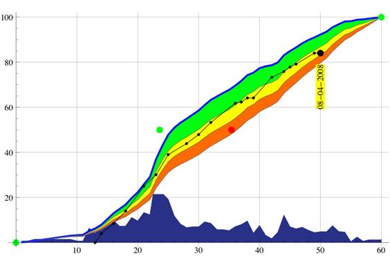
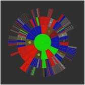

## 进度及数据管理工具

进度可视化分析工具——动态项目控制Dynamic Project Control（DPC）  

Toyhouse的长期合作伙伴之一比利时工程师Jean-Pierre Tollenboom提出的动态项目控制（DPC）工具，可以帮助项目团队，实时通过图表来了解项目进度及健康状态，从而及时调整任务计划。  

通过Xmind等工具将项目计划定义为任务树，而后即可通过DPC工具进行分析，生成项目工作量在不同时间段（图中X轴）的分布（如图中X轴上方蓝色区域所示）。同时任务进度的累积曲线，则反映了预期的项目进展，曲线越陡峭，则说明该时间段对应的任务进度越快（如图中蓝色曲线所示）。实时更新子任务完成数据后，DPC工具会根据当前进度及时间，生成项目实际进度位置点（如图中日期旁的黑点所示）。通过比较该点与预计进度曲线的位置关系，即可判断项目健康状况（如图中绿色、黄色、红色区域所示）。
  
同时，项目进度还会实时反映在项目任务树上（如图中圆盘状任务状态树所示），中心为总体项目进度，向外依次按子任务包含关系展开。

 

▲DPC工具中可以很方便地生成这样的项目计划图表  

 
 
▲DPC工具生成的Daisy Tree项目进度视图

