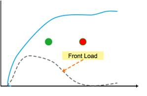
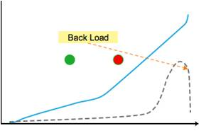
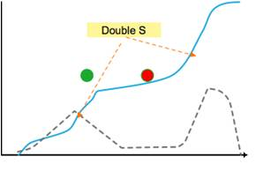
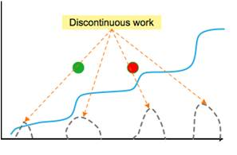

## 不同风格的任务规划
* 前紧后松型  
	* 更多的工作量集中在项目初期，这使得项目进度能够很快达到较高水平，为后期测试、调整留出足够时间。
 
* 后期突击型
	* 工作量集中在项目结束前，这使得留给测试、调整、修正的时间极为有限，不利于高质量地完成项目。如果初期项目计划制定后呈现这一形态，XLP挑战方往往会推荐任务方修正计划。
 
* 双峰型
	* 前后两次较高强度的工作阶段。优点是让团队能够利用中期进行调整，重新审视前期的工作成功，从不同角度对项目进行修改及调整。
 
* 非连续工作型
	* 在项目的不同阶段，工作任务持续推进，形成多个里程碑任务群。
 

