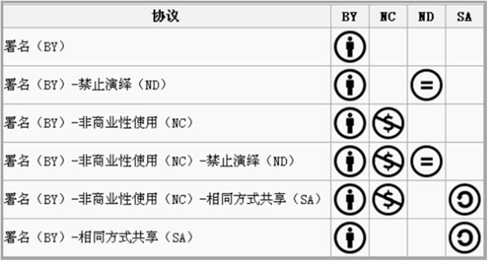

## 六套含不同条件的CC协议

署名：您允许他人对自己享有著作权的作品及演绎作品进行复制、发行、展览、表演、 放映、广播或通过信息网络向公众传播，但在这些过程中对方必须保留您对原作品的署名。

例如：小红在她的摄影作品上使用了“署名”的授权条款，因为她希望在他人在使用她的图片时尊重自己的署名。小明在网上找到她的摄影作品并希望在自己网站的首页上进行展示。在这种情况下，小明可以将小红的图片放在他的网站上，只要清楚地指明小红是作者即可。

非商业性使用：您允许他人对您享有著作权的作品及演绎作品进行复制、发行、展览、表演、放映、广播或通过信息网络向公众传播，但仅限于非商业性目的。   

例如：小明在他的网站上以包含“非商业性使用”要素的许可协议发表了他的摄影作品。在这种情况下，小红可以打印使用小明的这幅照片。但是，如果没有小明的允许，小红不得出售这张打印的照片。

禁止演绎：您允许他人对您的作品原封不动地进行复制、发行、展览、表演、放映、广播或通过信息网络向公众传播，但不得进行演绎创作。   

例如：小红在自己的一首歌曲上使用包含“禁止演绎”要素的许可协议。小明想截取小红歌曲片段混合在他的作品中而产生出全新的歌曲。在这种情况下，没有小红的允许，小明将不能这么做（除非他的歌曲构成合理使用）。

相同方式共享：只有在他人对演绎作品使用与您的原作品相同的许可协议的情况下，您才允许他人发行其演绎作品。

注：许可协议协议不能同时包含“相同方式共享”和“禁止演绎”许可要素，“相同方式共享”要素仅适用于演绎作品。

▲内容摘自知识共享文字大陆许可协议说明

