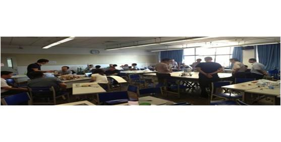

##HOW TO CONDUCT XLP
XLP参与者主要分为挑战方和执行方。其中挑战方主要负责活动设计，任务方负责具体执行。

* 输入&产出   

XLP通过挑战方活动和任务方活动两个阶段，分别实现学习活动的准备和高密度协同下的开拓性学习任务，从而达到在对工作流方法论的贯彻和引导下的跨学科知识的集成活动。  

XLP 的第一个阶段为准备期，一般时间在三周以上。从故事设计开始，由组织者依照可调动的知识与技术资源为基础，挑选一个可以体现交叉学科的故事“主题”。“主题”用以设定一个具备时事性与趣味性的工作背景，让挑战方团队在准备任务方的学习过程中，不断丰富和深化各种任务内容的知识和运用场景的技术内涵，并且经过小范围的测试，确认任务方能够在预计的时间范围内完成任务。  

第二个阶段为活动期，一般时间在一周以内，主要是由挑战方将“主题”呈现给任务方，并引导同样不同背景的任务方人员，进行团队分组、项目管理、并提供及时的知识与技术，以启发式任务方团队，在规定时间内完成整体性的任务，包括个人与团队的学习心得，多媒体的成果展示以及实物模型的制作与演示等工作。

* XLP要素

	* 合约式设计  
合约式设计（Design by Contract）的概念，是指在实质工作开展前，事先定义好目标，团队中每一个体都根据合约完成任务，以实现进度管理和最终团队成果的整合。

	* 过程记录与证据积累  
每位参与者是否按合约完成任务、阶段性成果、意见反馈等内容，通过统一的数据采集方法，集中记录收集。在检查合约的关键节点，加以相互比对，一方面提供了个人绩效评估的参考依据，另一方面也有利于进行同侪对比，督促个人工作。

	* 工作任务计划  
各群体协作中需要一套唯一的任务分派表，来对个人的工作加以记录，从而使团队中的个体相互知晓彼此工作内容和进度，实现协作。

* XLP特色

	* 团队活动  
XLP特色是通过团队的共同探索，让每一个人可以在发挥个性化特长的同时、体验到个人贡献与团队合作的互补性，可以通过相互见证学习的成果，扩大群体学习的效应。

	* 前沿技术  
组织XLP的过程中，必须不断引进先进技术，以提升学习及产出成品的效率。善用挑战方在学习新技术与新知识的学习经验，可以压缩任务方学习新知的时间。

	* 分布式工作流  
为了更有效地掌握个人的贡献，并且创造合作的机会，XLP特别注重利用网络化的内容分享与交流技术，让此类学习活动可以系统性地整合跨越地域的人才与技术资源。

	* 体验感  
挑战陌生感的学习，XLP活动设计重视“体验-认知-经验”的认知过程，通过亲身体验切入学习的状态中，认识到知识就是一种没有学科界限的资源。

	* 利用数字化出版流程、锻炼并见证沟通能力  
XLP要求利用工具，以及几种常用的数字化内容捕捉与展示的格式，如视频、演说、博客文字等、贯穿所有的学习活动。经由制作数字化内容的过程，锻炼并见证学习者的沟通能力，同时利用数字化的内容，累积群体的学习体验。

	* 精心预演  
从挑战方准备活动开始，反复不断在所有可行的机会中，预演后续活动的各项细节，Practice makes Perfect。

* XLP系列活动

* 导引课程

新生入学的导引活动，让学生们相互熟悉彼此的技术与性格特质。以创造一个共同的产品或服务为4天课程的工作目标

  
▲ 2012年8月工程管理硕士新生导引“智能物流系统”主题XLP

* 探究课程

带领学生到清华校内的重点实验室，参观各个领域的研究项目和各领域权威专家近距离接触，探究校内外新兴技术，寻找个人的兴趣

 

▲ 结合清华大学《实验室科研探究》的2013年工程管理硕士新生导引

* 产品开发课程
 
经过前面多种课程的知识累积，参与开发具有专业内涵的产品、服务或系统。利用前面多门课程的个人与团队经验数据，挑选并组建属于自己的跨学科团队。

▲低成本原子力显微镜（使用DVD读写头等低价元器件，实现匹敌价值上百万美元原子力显微镜的功能），清华附中初中学生，2014月1月跨学科系统集成设计挑战“我的空间我做主”主题XLP参与者，由台湾中研院胡恩德教授指导制作

