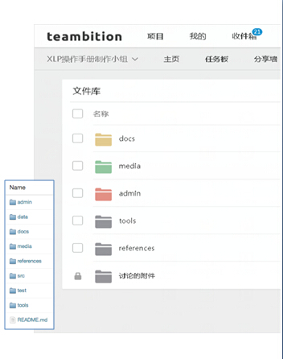

## 统一文件标准

* 文件标准统一保证所有信息能够有标准结构下进行统一管理，使文件在使用时就有统一的规格和方法。* 统一文件标注可以使发送的文件具有标准的使用效应。
* 文件标准包括：
	* 项目文件夹的结构与文件夹的名称
	* 每个文件夹内部文件的名称规范
	* 文件内容的结构与模版
* 记分组应该依照一套文件标准的协议，在过程中，与最后的评审过程，检查项目文件夹是否按照标准，经过整理。   

 

* admin : 所有与管理人力，物资等信息，应当放置在admin文件夹之下
* data : 大量数据，各种数据库文件的内容，可放置在data文件夹中
* docs : 而其他说明性的文件，放置在Docs之下
* media : 媒体内容，如照片，扫描图片，视频等，放置在media文件夹之下
* references: 重要参考文献，应当放置与references中
* src : 源代码可放在src文件夹之下
* test : 测试过程，测试数据等内容，则应放在test文件夹下
* tools : 软件相关工具，放在tools文件夹中
* 若有除此以外的其它需要，可以另行新建目录存放。这些规范，将有利于后续人员使用这些内容，请一定遵守

