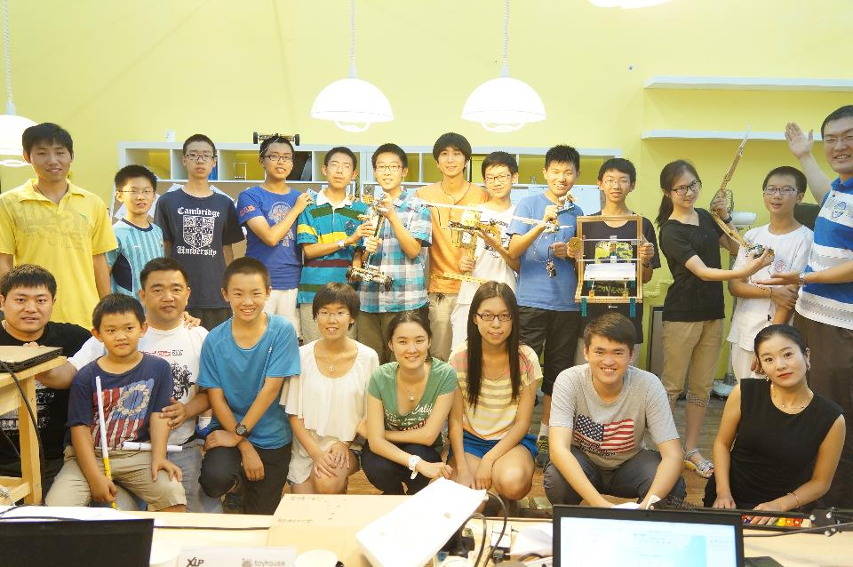

#活动成果形式
*Outcomes and Deliverables*

---

   
学习活动中可以做任何的活动，不同的活动内容就有不同的在极限过程中的体验、发现、收获，因此，我们通过撰写商业计划书、财务报表、产业分析报告、制作微电影或者直接生成原创的产品、可重组跨学科协作团队等方式来表达自己的活动成果，以上的这些只是其中的一小部分，XLP活动是多种多样的，所以获得的成果可以以任何形式出现。鼓励学生把自己的感受、发现、成果分享到网站或者形成一本书，分享活动的快乐，将同样的学习思维模式带到自己的学习环境中。

