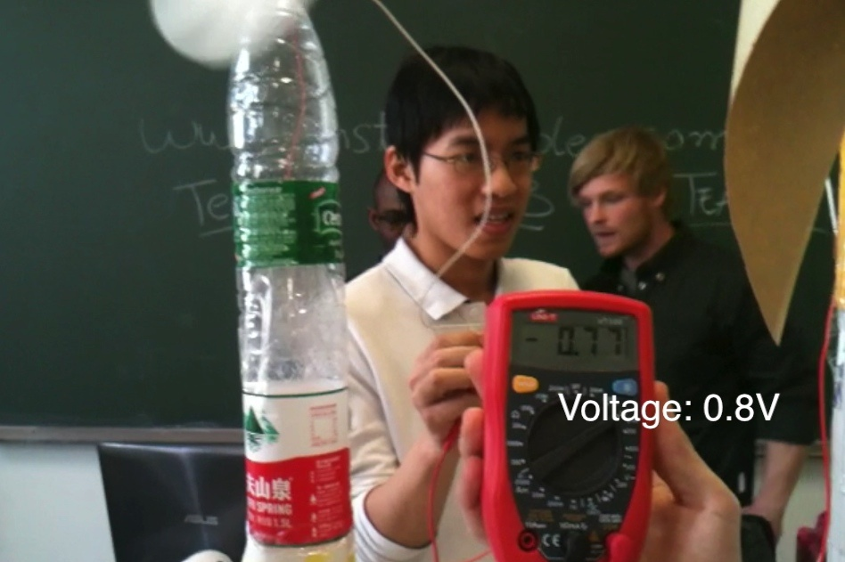

 3. 全球制造战略
  
 
  
    * 课程：
        + 课程主题	全球制造战略
        + 时长	3学时 × 16周（7天为一个周期，挑战方5天，任务方2.5小时）
        + 课程认证	2学分
        + 挑战方	清华大学留学研究生，6人
        + 任务方	清华大学留学研究生，30人
    * 学生自主学习主题：分析全球最具影响力的经济体，研讨全球制造战略。结合本地调研或项目开发学习相关知识
    * 信息交换节点：每周上课前教师监督该周学习活动学生的课程准备工作，修正错误，提出建议，保证课程内容的准确性，并建立每节课之间的逻辑联系。
    * 学习活动的地点：教室学习团队交流会周边社区教师办公室实验室
    * 学习重心前移：学习团队在学期初制定项目目标，每周完成既定的工作量，课上展示交流阶段性工作成果。授课团队提前一周时间准备知识点讲解的内容，反复理解并提炼，传授给全班其他学生。