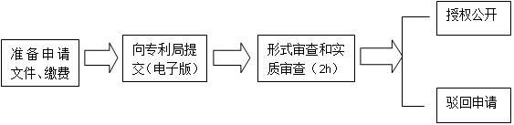

##XLP法律规则（智产部分）
* 研发出一项新技术可做出的选择
	* 专利：
优点：垄断性强，若市场前景好的技术，能较好的获利
缺点：经历复杂的申请程序，缴纳申请费用和专利年费，有时间限制
	* 技术秘密：
优点：无须经历申请程序、缴纳各种费用，无时间限制，技术范围比专利广
缺点：若其他组研发出相同技术，市场优势丧失
	* 开源：
能够利用他人在此技术上所作的改进技术

* 哪些技术可以申请专利
对特定技术问题具有新颖性、创造性和实用性的特定解决方案。注意：
	1. 必须是将自然规律在特定技术领域进行运用和结合的结果，科学发现不可以申请专利；
	1. 可以是原创性发明创造，也可以是在普通技术方案基础上的改良发明；
	2. 新颖性，指在申请专利之前没有其他人创造出同样的技术方案，也不属于任务方必须掌握的基础技术；
	3. 创造性，指申请专利的技术方案必须有实质性特点和进步，也就是说该技术方案不能是对公知技术的简单替换，与公知技术的水平相比必须有所提高；
	4. 实用性，指技术方案应当能够制造或使用，具有可实施性，并且能产生积极的效果。

* 专利申请程序

	1. 下载申请表格，准备相关文件，主要是专利申请表
	2. 向XLP专利局[1]提交一份电子版，缴纳申请费用 XXX元/件先申请原则：电子版文件通过XLP专利局平台提交，实行先申请原则，即两个申请人就相同的技术方案向XLP专利局提出申请的，由最先提交申请文件的任务方获得，而不论发明完成的先后，提交申请文件的时间以收到申请的时间为准；先用权人，是指在专利权人之后、专利技术授权公开之前提交相同技术方案申请的小组，或指专利技术公开后10分钟内提交电子版申请并有证据证明系独立开发的任务方。先用权人有权继续使用专利技术，不构成侵权。
	3. XLP专利局对申请进行在2小时内的形式和实质审查，对符合申请条件的技术方案，当场授予专利权，颁发专利证书；
	4. 由XLP专利局在平台上公开授权技术方案的全部内容；
	5. 在XLP专利局作出授予专利或者驳回申请的决定之前，申请人可以口头申请撤回专利申请或者将其转变为开源。

* 开源程序（以CC 的形式无偿公开）
	* 开发出一项新技术的任务方可以选择申请专利，也可以选择开源。选择开源的小组需要下载并向XLP专利局提交电子版的备案表，并在备案表中注明公布此技术方案文本所使用的CC协议[2]。开源程序同申请专利的程序。最先提交有效文件的任务方为开源人，开源申请一经提交不得撤回。
	* 开源人享有无偿使用在开源技术基础上改进的技术方案，无论改进技术的小组是否申请了专利。若开源人选择了CC协议中“以相同方式共享”的方式，则在开源技术基础上改进的技术也必须以开源的方式公开。

 	* [1]  XLP专利局专利审查工作由法院法官及技术顾问

 	* [2] CC协议的使用请参见XLP版权与知识共享规则，并请注意：CC协议只限制他人使用该文本的权利，版权不保护创意，因此一旦选择技术开源，他人对技术和创意本身的使用是不受任何限制的。

* 交易程序
	1.双方通过自由协商拟定技术转让或许可使用合同；
	2.双方向专利局提交已签字的合同（电子版）进行备案。

* 纠纷处理程序
	* 1.专利无效纠纷
自专利局公告授予专利权之时起，任何人认为该专利权不符合授予条件的，可以请求专利复审委员会宣告该专利无效，程序如下：
    1）向专利复审委员会提交专利无效申请（电子版）；
    2）专利复审委在自收到申请之后一小时内对申请进行审查，并作出终局决定；
    3）专利复审委员会在官方平台上公开该决定。
	* 2.合同或侵权纠纷
	因合同签订、履行、专利侵权等发生纠纷的，可以向法院提起诉讼，程序如下：
    1）向法院提交起诉状，向法院交纳诉讼费（  ）元；（注：收费标准为诉讼标的额的百分之五，标的额低于1000元的诉讼费50元）
   	2）发生纠纷的双方至少派一名组员到法院进行答辩；如果原告组无组员出庭，则视为原告撤销诉讼，反之如果被告组无组员出庭，则视为被告败诉；如果原告或被告一方或双方为多数（二者或以上），则需要多数的一方或双方选定代表组（代表人）代表本方进行诉讼，行使诉讼权利，履行诉讼义务，其所为的法律行为对本方全体成员产生法律效力，法院所做判决对本方全体成员有效。
   	3）法院在两小时内作出裁决，并在法院官方平台公开裁决结果。
	* 3.XLP法院受理时间为：08:00--21:00，XLP法院所做判决为终局裁判。
