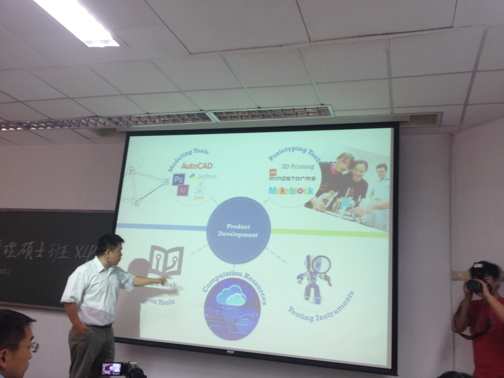

#  使用Git及Gitbook制作数字出版物

* 课程：

     + 课程主题：工程管理硕士新生导引课2-使用Git及Gitbook制作数字出版物
        + 时长：挑战方2个月，任务方连续80小时
        + 课程认证：2学分
        + 挑战方：不同院校、不同专业的挑战设计方，20-30人
        + 任务方：清华大学工程管理硕士，129人

 * 学生自主学习主题：利用先进的版本控制系统，信息共享平台及比特币等网络化学习资源、虚拟化交易工具制作数字出版物

 * 信息交换节点：探访整个校园与多个重点实验室，并且把整个4天的学习过程体验以数字化工具记录，在网络集成的媒体平台发布报道及总结等文件，每天进行故事板设计与进度报告;根据Git版本控制获取成员贡献信息;根据最终版本与初版对比评价组员贡献

 * 学习活动的地点：教室、实验室、教师办公室

  * 学习重心前移：课程准备团队由教师指导，由部分学生执行，提前数个月进行课程设计。确定知识点，并相应设计课程主题和学习任务，开发课程教具，进行课程演练，最终将前期准备的内容浓缩到4天课程之中，呈现给参与课程的学生。

