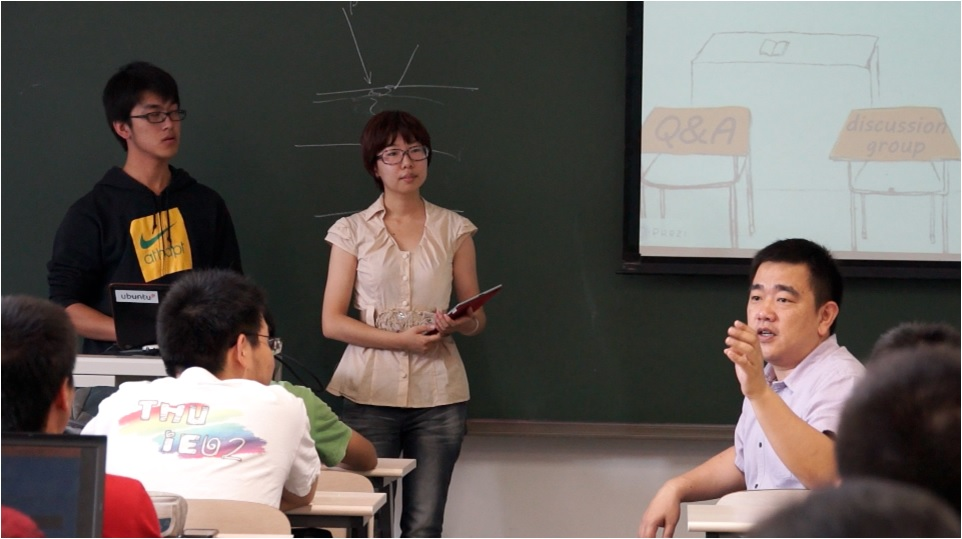

##按照XLP理念教学的清华大学本科生课程--数据库原理
  

   - 课程：
        + 课程主题：数据库原理/数据结构与算法
        + 时长	3学时 × 16周（7天为一个周期，挑战方5天，任务方2.5小时）
        + 课程认证：2学分
        + 挑战方：清华大学本科生，6人
        + 任务方：清华大学本科生，70人
    - 学生自主学习主题：利用数据库知识，设计并构建一个网站，收集、管理数据，并实现特定的功能
    - 信息交换节点：每次上课前，教师监督参与该周学习活动学生的课程准备工作，修正错误，提出建议，保证课程内容的准确性，并建立每节课之间的逻辑联系。
    - 学习活动的地点：教室，学习团队交流会，教师办公室，实验室等
    - 学习重心前移：学习团队在学期初制定项目目标，每周完成既定定工作，课上对流阶段性工作成果进行展示交流。授课团队提前一周时间准备讲解的内容，反复理解并提炼，传授给全班其他学生。

