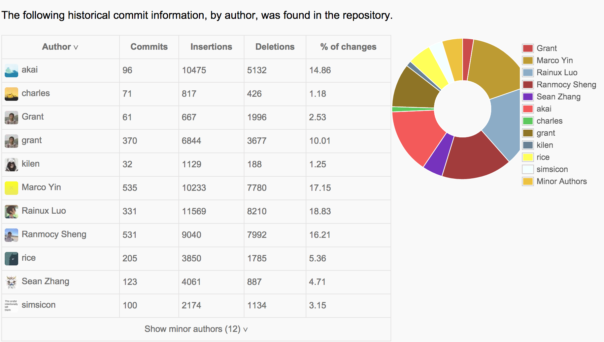
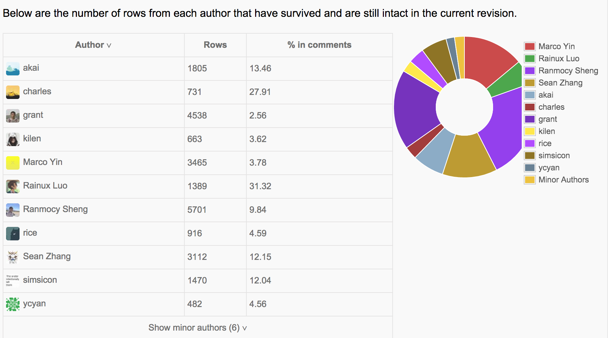

###工程管理硕士新生导引课（2014）- Git数据分析

##### 根据Git数据获取成员贡献信

  
 
  

* 通常只有一两个人贡献大部分的内容
* 如果发生一些规律，是否符合设计预期

-----
#####根据最终版本与初版对比评价组员贡献质量
 

-----

##### 趋势数据分析

 

* 分析任务方在使用Git工具时的学习进程
* 比对过往模型，必要时进行干预
* 分析任务方的行为模式，同样可以应用到处Git外的其他工具学习中

------

### 工程管理硕士新生导引课（2014）- 交易数据分析

#####获取成员贡献信息

 

* 分析组员构成与交易行为之间的关系
* 挑战方需要关注交易数据与团队表现之间的关系

------

#####交易数量与交易金额分析

 

* 挑战方关键输入，哪些输入对数据变化产生哪些影响，良性还是恶性
* 分析数据区别对交易量和交易金额的影响
* 给挑战方在控制整体课程进程方面提供一个可参考的模型

------

### 工程管理硕士新生导引课（2014）- 法律数据分析

##### 获取成员贡献信息

 

* 分析组员构成与法律行为之间的关系
* 挑战方关注法律行为与团队表现之间的关系

------

##### 法律认证数量与纠纷数量分析

 

* 分析任务方法律行为认知的发展情况
* 法律意识的成长模型

------

### 经验总结

##### 学习过程中的问题：
1. 现场缺少控制，有些混乱；
1. 对学生新知识的接受能力未多加考虑；
1. 缺少明确流程和对整体项目认识的讲解。

##### 学习过程中的改进方面：
1. 增加如何建立团队的方法，例如：可参考 AMA（美国管理协会）团队建立培训；
1. 增设挑战者完成任务追踪方式，可参照任务者的进行；
1. 制定的任务可根据眼前热点问题提出。

