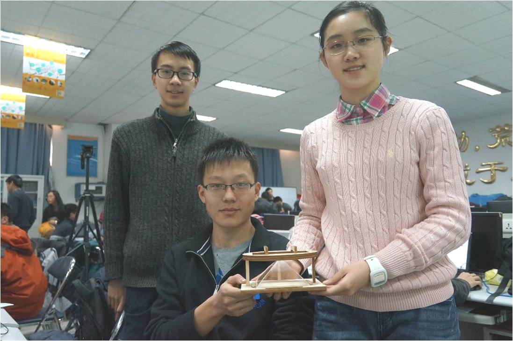

###2014.01 跨学科系统集成设计挑战
 

* 课程主题：2014年 跨学科系统集成设计挑战 ——“设计无人岛开发方案”

* 时长：挑战方2个月，任务方连续80小时

* 课程认证：2学分

* 挑战方：跨院校、跨专业、多年龄层团队，20-30人

* 任务方：清华大学本科生，70人

* 学生自主学习主题：搭建一套自动化转运系统，包括物联网、自动导向车辆等，并整合为完整产品，制作商业计划向模拟投资人筹款

* 信息交换节点：制定并演戏登岛救援快速响应，结合政经形势进行初步分析，制定演习方案，制作演习设备

* 学习活动的地点：工厂、实验室、教师办公室

* 学习重心前移：课程准备团队由教师指导，由部分学生执行，提前数个月进行课程设计。确定知识点，并相应设计课程主题和学习任务，开发课程教具，进行课程演练，最终将前期准备的内容浓缩到4天课程之中，呈现给参与课程的学生。
