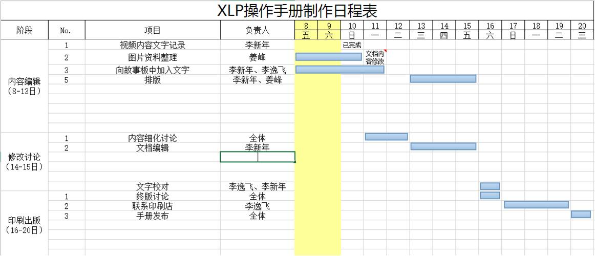
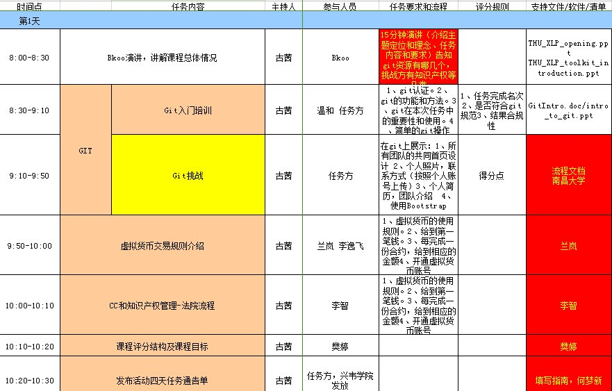
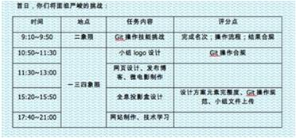

## 挑战方工作文件

在XLP活动进行中，挑战方需要制定工作文件，用来指导并记录挑战方的工作。

其中最为重要的是在初期做出一份整体的时间大纲，作用与故事板相同，并在此基础上逐步细化时间表，   这样可以使得团队学习工作更有效率，沟通也会更顺畅。

## 工作目标定义

*  首先要确定目标

  以合约的方式描述工作内容

>【注意事项】在实际操作过程中，工作目标就是团队协作的合约，所有的标准操作都需要依照合约进行

## 任务时间表制定

*  根据目标和人员制定任务时间表

>【注意事项】任务时间表的确定是挑战方（检查者）在项目开始前对个人的任务量与能力做基本评估，或在进行多次测试后制定出的切实可行的时间表，否则时间安排不合理会直接导致之后的任务难以执行下去，合约被打破。

*  任务分配派发

>【注意事项】任务需要挑战方（检查者）派发给任务方（执行者），在这个过程中，挑战方需要确保任务信息准确无误地发放给任务方，确保双方信息对等。

*  任务完成情况跟踪

>【注意事项】合约履行的最后一步就是挑战方需要在任务方执行完毕后进行完成情况跟踪。如果任务方未能在规定时间完成，挑战方需要记录并计分，或是及时调整时间表，确保合约履行顺畅。

