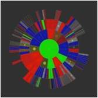

## 挑战方进度及数据管理工具

* 前期准备工作管理工具

    * Teambition

    

    * 进度管理工具

* 现场执行监控工具

以2014MEM入学引导课程专利局记录现场数据的工具为例：

仅使用一个txt文档记录

说明现有挑战方角色在执行过程中使用的工具并不容易汇集同在一个数据库中，可视化条件很差，不利于监控。

   除开使用软件工具git、teambition对挑战方进行前期数据记录，在项目执行过程程，我们也需要将挑战方实际操作行为暴露在公众视野中，接受执行者、主办方的监督。最直接的体现就是将后台所有操作结果以数据、图表的形式通过“微信平台”、在教室增加显示展现给大家，如挑战方有任何不完善、不规范操作可及时反馈给主办方。
同时，这样也能增强项目执行过程中数据的可视化。

* 计分组：使用微信平台计分，让执行方时刻了解自己得分情况，对有质疑的得分及时时向法院提交诉讼。

2014级MEM各组组员分数展示：

后期可进一步改善：增加详细项目

分数分析举例：

    * 法院：使用Teambition系统，法官和每个小组的法务专员都加入项目组，3步流程提起诉讼->审判中->判决结果

    * 专利局：使用excel表检验，包括默认有的专利和版权以及之后的转让、购买和授权等记录

    * 市场部：使用excel公示出所有资料和技术服务的价格,提供基础报价表、防止挑战方乱报价；提供实时及累计的交易数据，刺激激金融市场活跃度。

    * 挑战方所有部门：使用excel检验出勤情况

* 对全程进行管理的工具

进度可视化分析工具——动态项目控制Dynamic Project Control（DPC）

Toyhouse的长期合作伙伴之一比利时工程师Jean-Pierre Tollenboom提出的动态项目控制（DPC）工具，可以帮助项目团队，实时通过图表来了解项目进度及健康状态，从而及时调整任务计划。

通过Xmind等工具将项目计划定义为任务树，而后即可通过DPC工具进行分析，生成项目工作量在不同时间段（图中X轴）的分布（如图中X轴上方蓝色区域所示）。同时任务进度的累积曲线，则反映了预期的项目进展，曲线越陡峭，则说明该时间段对应的任务进度越快（如图中蓝色曲线所示）。实时更新子任务完成数据后，DPC工具会根据当前进度及时间，生成项目实际进度位置点（如图中日期旁的黑点所示）。通过比较该点与预计进度曲线的位置关系，即可判断项目健康状况（如图中绿色、黄色、红色区域所示）。

同时，项目进度还会实时反映在项目任务树上（如图中圆盘状任务状态树所示），中心为总体项目进度，向外依次按子任务包含关系展开。

▲DPC工具中可以很方便地生成这样的项目计划图表

▲DPC工具生成的Daisy Tree项目进度视图
