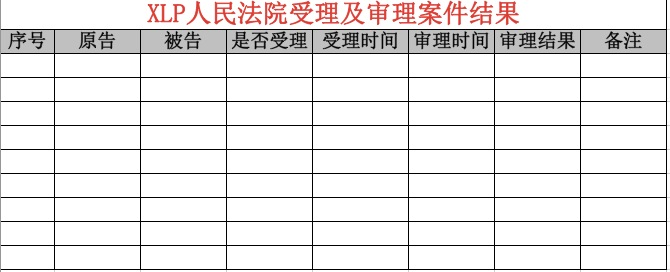
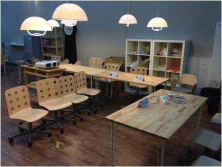

## 挑战方前期准备工作的内容

* 挑战主题及任务
	* 主题及任务介绍材料
	* 挑战方介绍材料
	* 开场词

* 现场执行安排
	* 现场执行时间表
	* 挑战方现场职责表

* 现场执行派发材料
	* 数字化材料
	* 实体材料

* 现场执行检验系统
    * 计分组：使用微信系统计分，包括每天的所有的得分项及满分数值和个人得分

    * 法院：使用excel表检验，包括每天的所有受理的案件和相应的处理结果

    * 专利局：使用excel表检验，包括默认有的专利和版权以及之后的转让、购买和授权等记录

    * 挑战方所有部门：使用excel检验出勤情况

* 场地
	* 活动空间
	* 设备及工具

