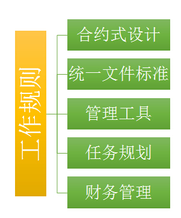

## 挑战方工作规则

在团队管理中，我们要用上面提到的所有工具来管理我们的团队，用计分的方式来评价团队中每个人员对团队做出的贡献。我们用财务管理、任务规划、统一文件标准，使用管理工具等工作来对他们的完成度进行打分，以此进行对团队更系统化的管理。

--12 （team10）陈沧

* 管理工具
    * 前期准备工作管理工具
        * teambition，截图
    * 现场执行管理工具
        * 计分组：使用微信系统计分，包括每天的所有的得分项及满分数值和个人得分

        * 法院：使用git系统，会把每天的所有受理的案件和相应的处理结果发布在git上，相关人员自行去下载（考虑使用teambition系统，提起诉讼->审判中->判决结果 3步流程）

        * 专利局：使用excel表检验，包括默认有的专利和版权以及之后的转让、购买和授权等记录

        * 挑战方所有部门：使用excel检验出勤情况

