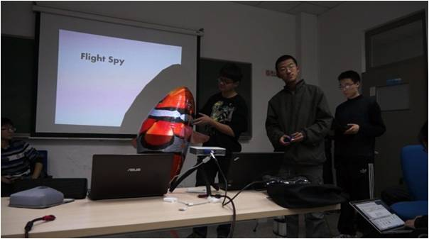

## 测试与故事发布

在活动策划中，由于挑战方多个部门是在分布式的情况下进行开发，即使有常态的沟通机制，活动前期的模拟测试也是非常必要的。一方面测试过程可以发现各模块之间衔接时可能存在的问题；另一方面，测试过程可以检验活动测试人数增加的情况下，可能出现的问题。

测试的主要内容大致分为三大块（工具、流程、文档）。

工具部分测试的重点内容包括工具学习过程、工具学习过程、工具的压力测试等。工具学习过程的测试是测试发布任务后，任务方中对要使用的工具完全未接触的人的学习难度测试。使用过程测试是测试工具在频繁使用时，可能出现的问题。工具的压力测试包括硬件和软件两大部分，比如网络路由器的压力测试、工具使用环境的测试、多人同时使用软件时的压力测试等内容。

流程部分测试是测试拟定的故事板演绎全过程。

文档部分测试是测试拟定的故事版中给出的参考文件在规定时间内的可阅读性、可理解性等内容。

