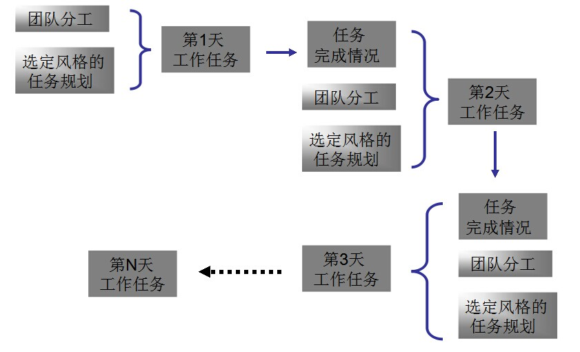
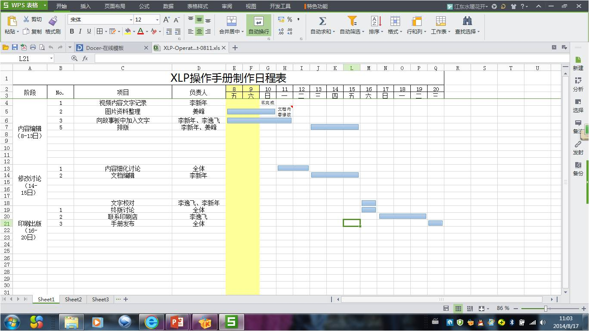
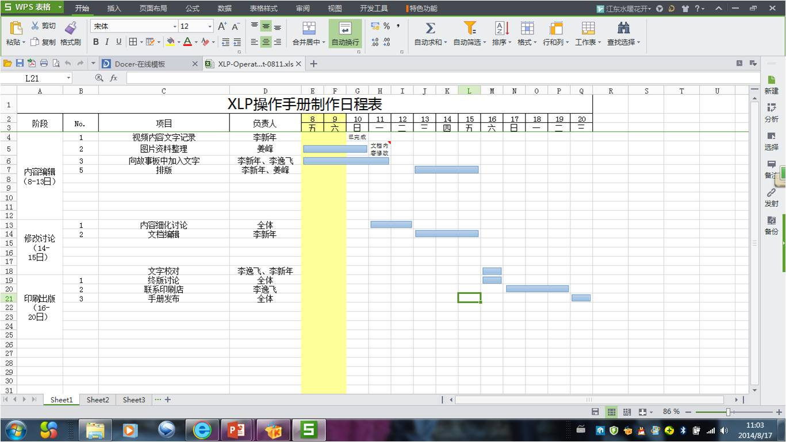
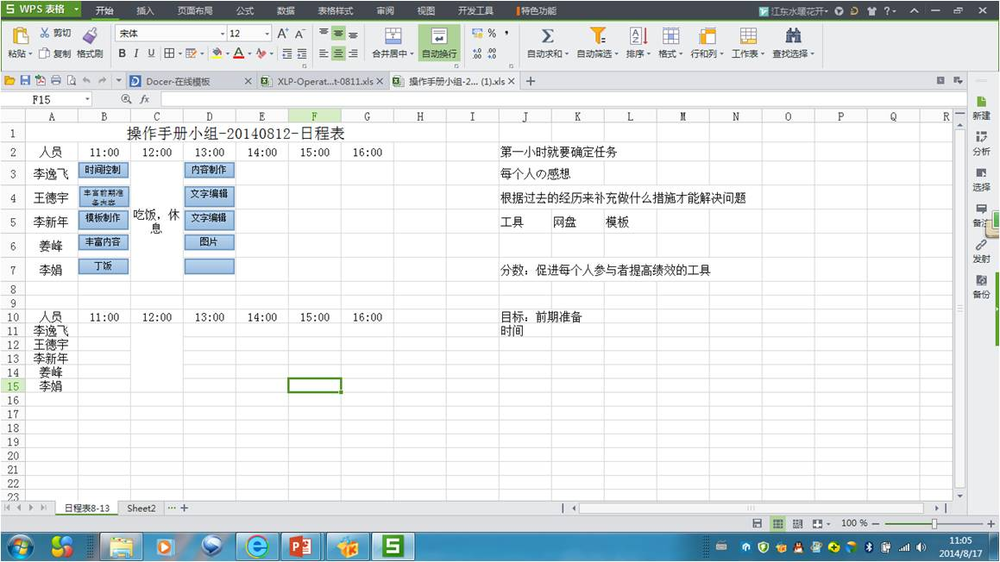

## 任务规划与派发

制定每天的任务执行表格和总体的大规划表。在每一天的活动开始之前，针对每个人的职务、任务完成情况，制定一份非常详细的任务执行表格，并且督促组员严格按照计划完成产品项目。同时你需要制定一个总体的大规划表（不要制定地太死板，可以随时更改改进），这个表格必须包括整个活动的总目标和每天的小目标。当成员们每完成了一个目标之后在大规划表上做标注清楚。同时要将所有的表格上传至Teambition和Git。

## 挑战方案例

--20
反馈(team12)
1.调查问卷-问卷网系统
2.
