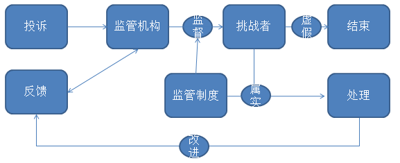

## 任务规划与派发

制定每天的任务执行表格和总体的大规划表。在每一天的活动开始之前，针对每个人的职务、任务完成情况，制定一份非常详细的任务执行表格，并且督促组员严格按照计划完成产品项目。同时你需要制定一个总体的大规划表（不要制定地太死板，可以随时更改改进），这个表格必须包括整个活动的总目标和每天的小目标。当成员们每完成了一个目标之后在大规划表上做标注清楚。同时要将所有的表格上传至Teambition和Git。

## 任务方对挑战方的反馈

* 挑战方通过任务方的反馈和投诉进行自我改善

- 任务方可通过投诉和反馈两种方式实行对挑战方的监督。
- 监管机构有义务对挑战方进行主动监督并进行处理。
- 监管制度是监督过程中行为的重要依据。
- 对于不合法行为进行处理后应及时改进监管机制并向任务方进行反馈。

* 投诉
- 鼓励任务方对挑战方成员的不合法行为进行主动投诉。
