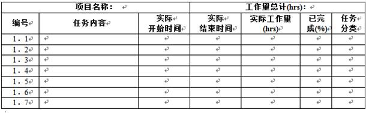

## 任务规划与派发

制定每天的任务执行表格和总体的大规划表。在每一天的活动开始之前，针对每个人的职务、任务完成情况，制定一份非常详细的任务执行表格，并且督促组员严格按照计划完成产品项目。同时你需要制定一个总体的大规划表（不要制定地太死板，可以随时更改改进），这个表格必须包括整个活动的总目标和每天的小目标。当成员们每完成了一个目标之后在大规划表上做标注清楚。同时要将所有的表格上传至Teambition和Git。

## 挑战方反馈

### 挑战方的监督管理
       挑战方作为任务的设计者，掌握着各种各样的资源，通常他们主导着学习过程的发展。在这样的条件下，有必要对挑战方的行为加以约束，以确保学习过程公平有序的进行下去。
####挑战方的监管机制
1. 工作合约
- 监管制度
- 监管机构
- 参与者反馈
- 投诉

####工作合约
- 在XLP中我们创建了一个近似的法律环境，倡导基于合约的工作关系，在合约中约定限制挑战方成员的行为。

####监管制度
- 监管制度是监管人员规范挑战方成员的纪律标准，亦是挑战方成员的行为规范。

####监管机构
- 由XLP各方成员代表组成的委员会。####参与者反馈
- 以问卷的方式向任务方进行调研。

####投诉
- 鼓励任务方对挑战方成员的不合法行为进行主动投诉。

####监管流程

- 任务方可通过投诉和反馈两种方式实行对挑战方的监督。
- 监管机构有义务对挑战方进行主动监督并进行处理。
- 监管制度是监督过程中行为的重要依据。
- 对于不合法行为进行处理后应及时改进监管机制并向任务方进行反馈。

### 挑战方表现调查问卷
亲爱的同学：您好！

在XLP活动中，挑战方是规则的制定者，为任务方制定活动任务，提供近乎真实社会的活动场景，并根据现场实际情况控制活动进程，引导任务方完成任务。挑战方在XLP活动中占有非常重要

的地位，为了更好的提高XLP活动的质量，我们特意进行此次调查活动。希望您能如实填写，感谢您的配合。

1.您对此次XLP活动中挑战方的整体表现满意么？

A.满意 B.一般 C.不满意

2.您感觉挑战方此次设计的XLP活动形式如何？

A．形式新颖 B.一般 C.缺乏新意

3.活动挑战方发布任务、介绍XLP工具的过程是否清晰易懂，简洁明了？

A．是  B.一般 C.否

4.XLP挑战方组建的市场、法庭、知识产权局等部门工作人员在活动中表现如何？

A．优秀 B.良好 C.差

5.您认为挑战方设计的活动主题可操作性如何？

A．容易操作 B.操作中可能存在少数困难 C.难以操作

6.您感觉挑战方与任务方的交流情况如何？

  A．频繁  B.一般  C.较少

7.您感觉此次XLP活动过程中挑战方是否很好的达成了其预定目标？

A．是 B.不确定 C.否

8.在完成任务的过程中，挑战方组织协调情况如何？

A．很好，任务完成过程很顺畅
B．一般，偶尔出现流程不畅的情况
C．不好，组织混乱，流程不畅

9．您是否能够合理的在完成任务的过程中发表自己的看法，提出合理的建议？

A．能 B.偶尔可以 C.完全不能表达自己的意见

10.您感觉挑战方在此次XLP活动中存在什么问题，对以后开展的XLP活动有何建议?
###挑战方工作总结模板
|项目|内容描述|
|:----:|:---:|
|活动目的|（设计活动主要目的）|
|过程简述|（过程进行如何）|
|总体效果|（是否达到活动目的）|
|成果描述|（活动所形成的主要成果包括活动中形成的其他成果描述）|
|缺陷描述|（活动设计及其他方面缺陷）|
|紧急情况及解决|（是否有紧急情况发生及采取的相应措施）|
|组员贡献|（通过组员行为追踪检测系统综合评定的组员贡献）|
|其他|（其他需说明的事项）|
|总结|（对活动的总体评价及经验总结）

###挑战方日志
#### 挑战方日志制定目的
在xlp项目中，挑战方会分为数个部门（市场、专利局、法院等）以模拟真实的社会环境。挑战方为任务方提出要求，规则，以及服务。挑战方与任务方式一个相互互动共同组成模拟的社会。为了保证xlp这个项目更好的完成。就要求规则能够公平公正，合理有度，需要挑战方每天提交日志来来为管控的一种有效手段。
#### 挑战方日志模板

1. 计划内任务

说明：本表采用增量填报，即对于已经完成的任务无须删除，未完成的任务实际工作量采用累计工作量填报，百分比为实际投入累计工作人时/计划人时计算得到，代表任务完成进度。对于计划估算工作量不准确的情况，允许百分比超过100%。此项为必填项。

1. 计划外任务

说明：非计划内任务即属于临时性分派的任务，属于计划外工作，但依然需要纳入项目管理范围。此项为非必填项，但对于有临时委派的任务，此项为必填项

1. 问题报告

说明：本部分记录个人工作中遇到的问题，涉及计划、资源、技术，产品研发等与项目有关的问题，为非必填项。

2. 经验与教训

说明：本部分记录个人工作中的收获与体会，这是个人成长的直接数据来源，为最后的项目总结提供原始数据来源，建议填写但并不是必填项。

####日志审查及评定

每天挑战方人员必须提交日志，否则将得不到日志得分。根据日志中任务的完成情况作为任务得分的一个依据。
