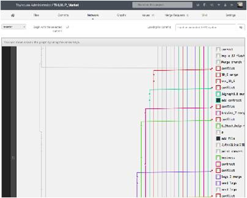
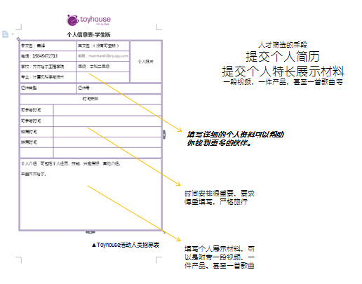
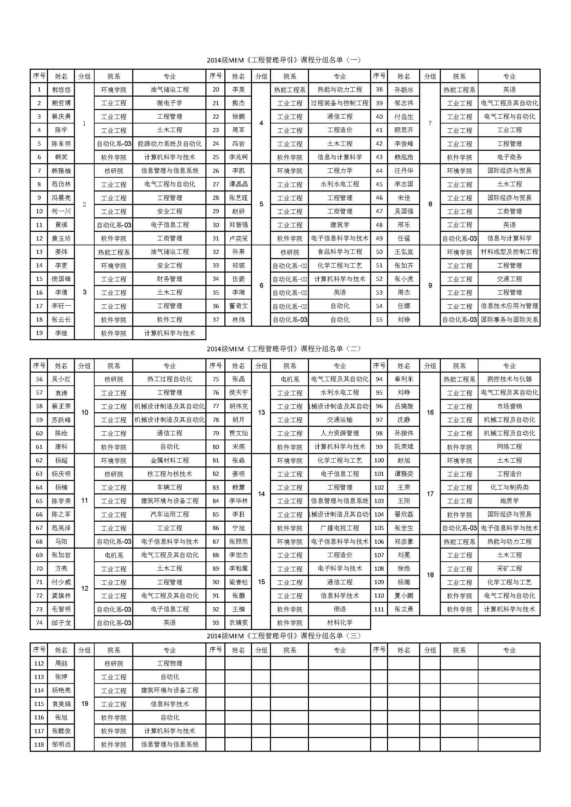

## 人员筛选和专长挖掘

* 人员筛选

由于活动的人群容量有限,XLP必须快速筛选出报名者中相对适合参与活动的人才，可以使用问卷调查，自由发挥的履历表，或者是用线上游戏、现场游戏等机制，根据每次活动的需求，筛选参与人员。

以Git game为例。我们认为所有参加XLP活动的人都需要使用某种网络化的数字内容分享工具，例如Git。所以我们把Git安装的过程与简单的Git操作指令都放在网上提供给报名的人。让所有报名的人在规定时间完成几个指定的Git操作任务的人就可以参加活动。因为安装软件的工作与学习基本操作的体验，都可以测试报名者解决问题的意愿。如果对这些基本的工具有抵触的心理，就大可不必参与活动。

另外一种现场筛选人的方法，就是让报名者自己自行组成小组然后选出自己的组长。在3到5分钟左右的时间内，给他们一个问题让他们讨论。也可以让这些人做一个十页左右的手绘简报(故事板)。这个简报将看出来那些人具有组织信息的能力与沟通群众的能力。
发言比较踊跃、比较喜欢带领他人的报名者，很快就会在现场展现他们的个性。不积极发言的人也可能有他们的特长，例如经由同伴的推荐。经过这层层小而巧的活动筛选，留下来的人选才会有一些对此类活动的心理准备。

工具使用范例

个人信息表范例

实际分组情况

组员首次活动30分钟，自我介绍，互相熟悉，设计组名和logo，选择组长，观察组员的反应，试着发现相关的合适人选。

* 人员专长挖掘

职业测评，如DISC
识别个人特质，为选择适合的团队角色提供依据
Git Game
判断个人是否能够尊重团队协作规则
18分钟的棉花糖挑战
可以识别团队的决策过程性格特点

