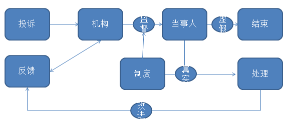

# 任务方对挑战方的反馈

挑战方通过整理任务方的反馈及投诉进行自我改善

### 反馈
- 以问卷的方式向任务方进行调研。

### 投诉
- 鼓励任务方对挑战方成员的不合法行为进行主动投诉。

- 任务方可通过投诉和反馈两种方式实行对挑战方的监督。
- 监管机构有义务对挑战方进行主动监督并进行处理。
- 监管制度是监督过程中行为的重要依据。
- 对于不合法行为进行处理后应及时改进监督机制并向任务方进行反馈。
