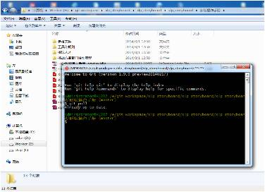

## 进度及数据管理工具

活动使用Git及Teambition两款软件进行团队进度及数据管理。
参与方可在活动期间使用这两款软件，以达到更便捷的数据交流、管理的目的。
主办方使用Git及Teambition对任务方各组进行计分，并可以通过Git收集数据的功能，分析各个参与者的能力。
这种对数据的收集和分析可以使参与者及时准确地了解到自己的优势。同时，这些数据可以作为主办方筛选人选的参照及依据。

--17(team10)
归纳到4.13（管理工具）
