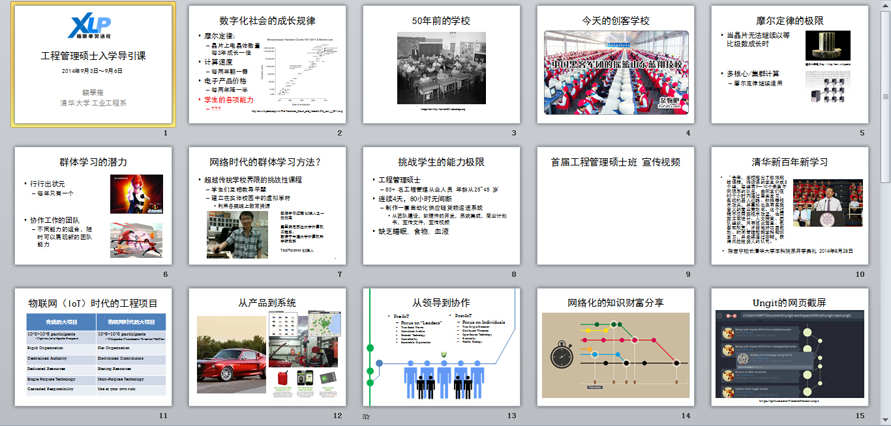
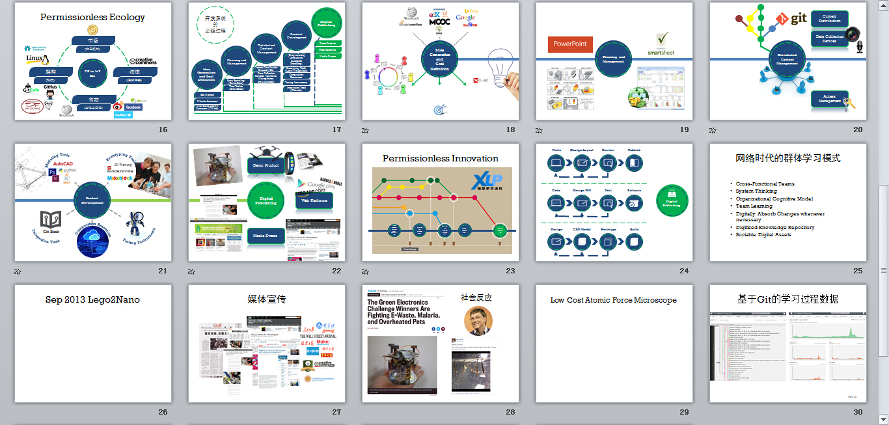
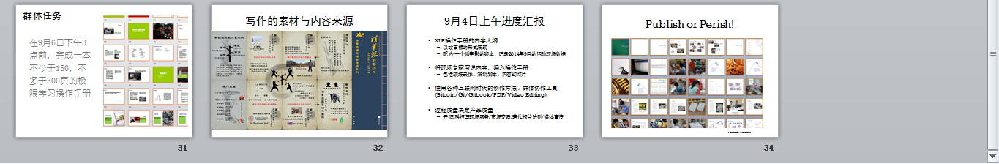
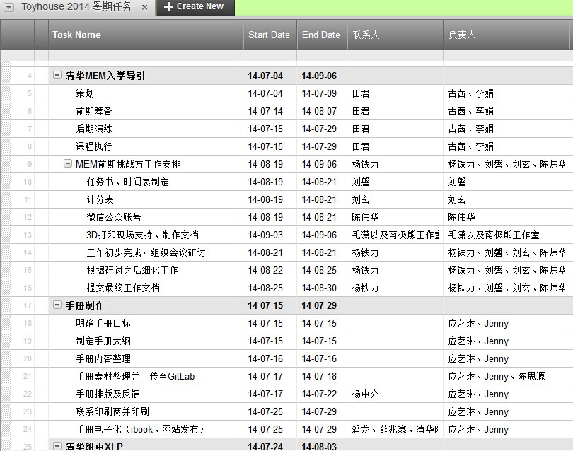
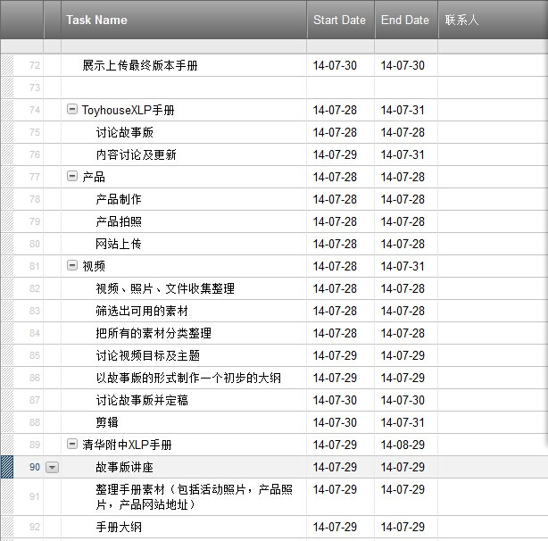

## 故事设计

了解以上的理论后，你可以初步的掌握XLP的活动内容和其经常使用的工具。那么你就可以按照你现有的设备和你所处的环境来制定一个属于你们的活动故事方案。通过主题设定、选定任务、模拟测试，来执行你们的故事设计。我们在附录中会给出一些之前做过的活动。你可以发挥创造力，做一个跟我们附录中所给的完全不一样的活动。

>注意：不要过快的进入细节的故事讨论，而要先制定故事大纲，，否则整个故事则会越讲越细，反而失去了故事主题。

（2014课程故事版）

例如2014级活动的故事设计过程中：
第一时间明确了活动的故事主题——要充分利用新的项目组织与协作理念、方式与工具，开展操作手册的编制。
在确定主题后，开始故事的大纲制定：
* 结合主题，开始进行主题内容的选择，决定整个故事
* 首先介绍极限学习模式的创造根源和现状，帮助学生了解极限学习过程的重要意义
* 然后介绍当前大型工程项目所体现出的新特点，互联网时代新型创作方法、群体协作工具的应用情况等内容，诠释活动主题
* 最后明确给出任务目标与要求

在完成了大纲制定后：
* 通过教学与学习的方式及效果济发展的方式及效果的巨大反差，增强学生对极限学习过程的意义的理解，提高学生的兴趣与参与意愿
* 对新特点、互联网时代创作方法、群体协作工具进行剖析，帮助学员对要采用的方法和工具形成较为直观的印象和了解
* 任务明确要提出具体的成果形式、指标要求，时间计划如有也要向学员进行明确，树立良好的契约意识
