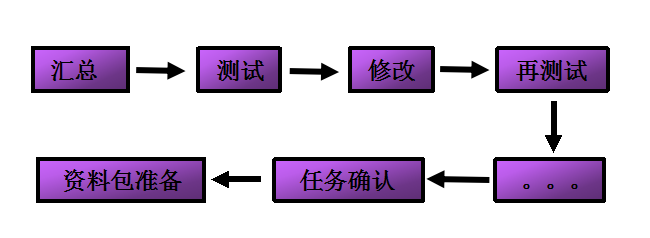
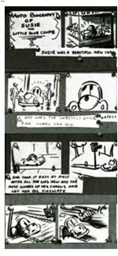
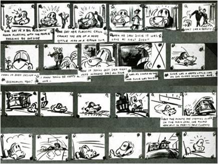

## 故事版设计方法

<<<<<<< HEAD

在活动策划中，由于挑战方多个部门是在分布式的情况下进行开发，即使有常态的沟通机制，活动前期的模拟测试也是非常必要的。一方面测试过程可以发现各模块之间衔接时可能存在的问题；另一方面，测试过程可以检验活动测试人数增加的情况下，可能出现的问题。

=======
*  故事板定义
	*  以简单的工具（如PowerPoint）,将内容梗概分成页面展示故事的逻辑，使所有人可以查看、更改或增加相应的内容。
*  故事板使用方法
	*  根据故事总体内容设计出简单的章节，使每个章节可以明确的表达，并利于他人的更改。
*  故事板使用注意事项
	*  所有的内容需要先做出故事板，做出大概的框架，先做出原型产品，再进行细化。

>>>>>>> 918d715a4b7f0bd96f82b4200e105c69ec273bd0

