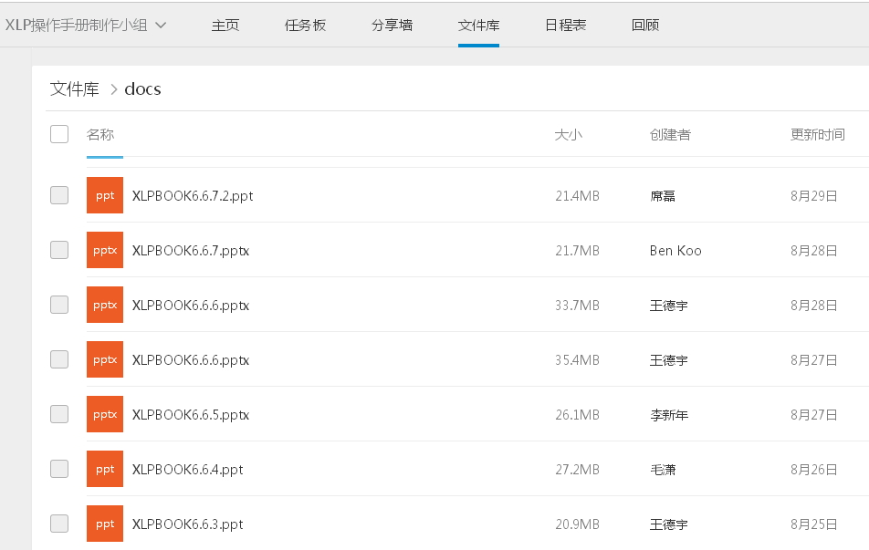

## 故事版设计方法

*  故事板定义
	*  以简单的工具（如PowerPoint）,将内容梗概分成页面展示故事的逻辑，使所有人可以查看、更改或增加相应的内容。
*  故事板使用方法
	*  根据故事总体内容设计出简单的章节，使每个章节可以明确的表达，并利于他人的更改。
*  故事板使用注意事项
	*  所有的内容需要先做出故事板，做出大概的框架，先做出原型产品，再进行细化。

>>>>>>> 918d715a4b7f0bd96f82b4200e105c69ec273bd0

  * 利用任务管理工具不断完善细化故事内容。
