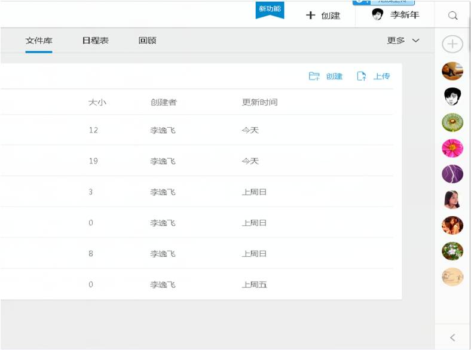

## 统一文件标准

* 统一文件标准保证所有信息能够在标准结构下进行统一管理，使文件在使用时就有统一的规格和方法。* 统一文件标注可以使发送的文件具有标准的使用效应。
* 文件标准包括：
	* 项目文件夹的结构与文件夹的名称
	* 每个文件夹内部文件的名称规范
	* 文件内容的结构与模版
* 在活动过程中与最后的评审中，记分组应该依据一套文件标准协议检查项目文件夹是否按该套标准经过整理。   

 

* admin : 所有与人力，物资等相关的管理信息，应当放置在admin文件夹中；
* data : 大量数据，各种数据库文件内容可放置在data文件夹中；
* docs : 其他说明性的文件，放置在Docs文件夹中；
* media : 媒体内容，如照片，扫描图片，视频等，放置在media文件夹中；
* references: 重要参考文献，应当放置与references文件夹中；
* src : 源代码可放在src文件夹中；
* test : 测试过程，测试数据等内容，应放在test文件中；
* tools : 软件相关工具，放在tools文件夹中；
* 若有除此以外的其它内容，可另行新建目录存放。以上这些规范，将有利于后续人员使用这些内容，请务必遵守。

