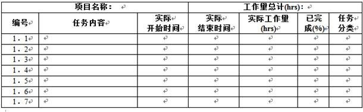
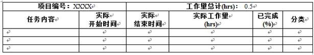

# 挑战方工作总结

###挑战方工作中日志
* 挑战方日志制定目的

在XLP项目中，挑战方执行时会分为数个部门（市场、专利局、法院等）以模拟真实的社会环境，他们为任务方提供活动任务，并引导任务方完成任务。为了保证xlp这个项目能够公平公正，合理顺利的进行，需要挑战方每天提交日志来作为管控的一种有效手段。

* 挑战方日志模板

一.挑战方日志制定目的

   在xlp项目中，挑战方执行时会分为数个部门（市场、专利局、法院等）以模拟真实的社会环境，他们为任务方提供活动任务，并引导任务方完成任务。为了保证xlp这个项目能够公平公正，合理顺利的进行，需要挑战方每天提交日志来作为管控的一种有效手段。

二.挑战方日志模板

1. 计划内任务

说明：本表采用增量填报，即对于已经完成的任务无须删除，未完成的任务实际工作量采用累计工作量填报，百分比为实际投入累计工作人时/计划人时计算得到，代表任务完成进度。对于计划估算工作量不准确的情况，允许百分比超过100%。此项为必填项。

1. 计划外任务

说明：非计划内任务即属于临时性分派的任务，属于计划外工作，但依然需要纳入项目管理范围。此项为非必填项，但对于有临时委派的任务，此项为必填项

1. 问题报告

说明：本部分记录个人工作中遇到的问题，涉及计划、资源、技术，产品研发等与项目有关的问题，为非必填项。

2. 经验与教训

说明：本部分记录个人工作中的收获与体会，这是个人成长的直接数据来源，为最后的项目总结提供原始数据来源，建议填写但并不是必填项。
三.日志审查及评定

每天挑战方人员必须提交日志，否则将得不到日志得分。根据日志中任务的完成情况作为任务得分的一个依据。

### 挑战方工作结束总结模板
|项目|内容描述|
|:----:|:---:|
|活动目的|（设计活动主要目的）|
|过程简述|（过程进行如何）|
|总体效果|（是否达到活动目的）|
|成果描述|（活动所形成的具体成果包括活动中形成的副产品描述）|
|缺陷描述|（活动设计及其他方面缺陷）|
|紧急情况及解决|（是否有紧急情况发生及采取的相应措施）|
|组员贡献|（通过组员行为追踪检测系统综合评定的组员贡献）|
|其他|（其他需说明的事项）|
|总结|（对活动的总体评价及经验总结）
