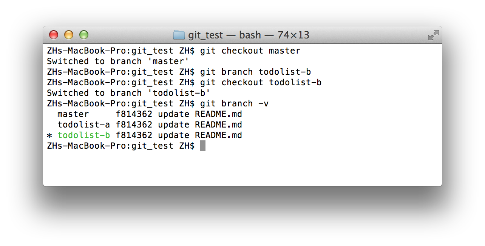

# Git

## 什么是版本控制

> 版本控制是一种记录一个或若干文件内容变化，以便将来查阅特定版本修订情况的系统。在本书所展示的例子中，我们仅对保存着软件源代码的文本文件作版本控制管理，但实际上，你可以对任何类型的文件进行版本控制

## 版本控制系统 Git 的特点

同生活中的许多伟大事件一样，Git 诞生于一个极富纷争大举创新的年代。Linux 内核开源项目有着为数众广的参与者。绝大多数的 Linux 内核维护工作都花在了提交补丁和保存归档的繁琐事务上（1991－2002年间）。到 2002 年，整个项目组开始启用分布式版本控制系统 BitKeeper 来管理和维护代码。

到了 2005 年，开发 BitKeeper 的商业公司同 Linux 内核开源社区的合作关系结束，他们收回了免费使用 BitKeeper 的权力。这就迫使 Linux 开源社区（特别是 Linux 的缔造者 Linus Torvalds ）不得不吸取教训，只有开发一套属于自己的版本控制系统才不至于重蹈覆辙。他们对新的系统制订了若干目标：

- 速度
- 简单的设计
- 对非线性开发模式的强力支持（允许上千个并行开发的分支）
- 完全分布式
- 有能力高效管理类似 Linux 内核一样的超大规模项目（速度和数据量）

自诞生于 2005 年以来，Git 日臻成熟完善，在高度易用的同时，仍然保留着初期设定的目标。它的速度飞快，极其适合管理大项目，它还有着令人难以置信的非线性分支管理系统，可以应付各种复杂的项目开发需求。


## 使用 Git 前的基本配置

1. 注册 GitCafe 账号

	```
	什么是 GitCafe
	
	GitCafe 是一个基于代码托管服务打造的技术协作与分享平台，这次您将使用 GitCafe 托管 XLP 手册的内容，向全世界展示您令人惊叹的成果。	
	```
1. 安装 Git
	- Widnows 和 Mac 用户请在 XLP 共享网盘中的 Git 文件夹中下载安装 Git
	- Linux 用户请使用发行版本自带的包管理工具安装 
1. Git 中设置用户基本信息（您的用户名和邮箱会出现在您的每个提交信息当中，方便识别与记分）

	```
	启动终端，键入以下命令配置基本信息
	git config --global user.name "您的 GitCafe 的用户名"
	git config --global user.email 您的GitCafe 的注册邮箱
	
	注：Windows 用户在任意目录点击右键选择 “git bash”启动终端，Mac OS X 和 Linux 用户启动终端
	```
	
1. 创建 SSH Key 用户身份验证

	```
	在终端中键入
	
	ssh-keygen -t rsa -C "您的 GitCafe 注册邮箱"
	
	执行命令后会先询问 key 的保存路径，使用默认值（直接回车），之后要求您为 key 设置密码，输入密码后回车（注意输入密码时，屏幕不会显示，输入完成回车即可），命令成功执行后，再执行
	
	cat ~/.ssh/id_rsa.pub
	
	即可获得 SSH Key（Windows 系统中若无法复制，可到对应保存地址找到 SSH 文件，以记事本格式打开。）

	```
1. 在 GitCafe 中添加身份验证

	
	
	```
	确保您已登录 GitCafe，打开 SSH 工钥管理页面 https://gitcafe.com/account/public_keys 选择“添加新的工钥”，为次公钥起名（比如 XLP），粘入 SSH Key ，并输入注册密码，点击保存即可。
	```

---
```
注：

1. 您可以用下面格式获取 Git 帮助：git help 命令
2. 访问 http://git-scm.com/book/zh/ 获取详细教程
3. 使用搜索引擎搜索问题答案
4. 求助现场工作人员（收费）
```
---


## Git 基础使用

阅读本章后您将掌握 Git 基本且常用的命令。您将可以初始化代码仓库；对文件进行跟踪和取消跟踪，暂存和提交更新；查看提交历史及它们之间的差异；以及从远端仓库拉取数据和向远端仓库推送数据。


### 获取 Git 仓库

我们可以通过将现有目录导入 Git 仓库和从已有 Git 仓库克隆一份镜像两种方式获取 Git 仓库。

#### 在现有目录下初始化 Git 仓库

将目录变为 Git 仓库非常简单，只需要在目录中执行以下命令初始化即可：

```
git init

```

初始化后，Git 将在目录中创建名为 `.git` 的目录来存放 Git 进行版本控制所需的所有文件。

接下来我们需要使用 `add` 命令将文件纳入 Git 管理进行版本控制

```
git add README.md //将 README.md 纳入 Git 管理
git add . //当前目录下的所有文件纳入 Git 管理
```

#### 从现有的仓库克隆

若您需要从现有仓库克隆一份镜像，只需要使用下列命令即可将该项目从项目地址克隆出一份 Git 仓库。

```
git clone 仓库地址

```

### 提交与推送

接下来，我们将对一些文件进行修改并将此次更新提交到仓库。


#### 文件状态

在 Git 仓库目录下的文件具有“已跟踪”和“未跟踪”两种状态。已跟踪的文件是指文件已被纳入版本控制，在您对项目文件进行更新后，它们可能呈现为未更新（相对上一版本没变化），已修改（相对上一版本有变化）或者已放入暂存区（相对上一版本有变化且待提交）。而未跟踪文件，Git 并不会记录它们的变化。


#### 提交
Git 中使用 commit 命令进行更新的提交，`commit` 命令将处于暂存区中的文件打包作为一次更新进行提交。

```
git commit -m "提交信息"
```

#### 实战

接下来配合查看文件的状态 `git status` 命令进行实战

首先创建一个名为 `git_test` 的空文件夹，其目录中运行 `git init` 初始化 Git 仓库。加入一个空文件 `README.md`，这时查看 Git 文件状态会得到如下结果：


表明 `README.md` 处于未跟踪状态，未跟踪的文件意味着 Git 在之前的提交中没有这些文件，接下来使用 `add` 命令将其纳入跟踪

```
git add README.md
```

再来查看文件状态，`README` 位于暂存状态，待提交，若现在进行提交，那么该文件当前版本将被保存在 Git 提交历史记录中。


接下来在对 `README.md` 进行修改，查看文件状态


`README.md` 这是同时具有了已暂存和已修改两个状态，这是怎么回事？当您运行 `git add` 的时候，实际上是讲当时的文件版本放入了暂存区，当您再次修改文件时，Git 探测到相对于暂存区您又做出了修改，于是 README.md 又具有了“已修改“”状态。这时工作目录中 README.md 为已修改版本，暂存区中是您用 `add` 命令纳入暂存区时的版本。

最后运行 `add` 命令将最终版本的 README.md 加入暂存区并提交

```
git add README.md
git commit -m "update README.md"
```

最后，使用 `log` 命令查看提交历史

```
git log

```


#### 推送

有时，我们需要将本地的 Git 仓库推送到远程仓库，这时需要加入远端仓库的地址

```
git remote add repo_name(比如 origin) '仓库地址'
```

再使用 `push` 命令将本地数据推送到远程仓库

```
git push -u repo_name(比如 origin) master
```

<!--GitGame 上传自己的联系方式-->

## 协同与多分支

在多人协作的项目中，每位成员都可以某一版本的项目为基础创建自己的分支，进行独立的提交而不与其他组员形成文件冲突，在该分支内容完成，成员将分支内容合并至主干（master 分支)。默认情况下，Git 会创建一个默认分支名为 master，我们之前的提交工作都是在 master 之下进行的。

下面展示了分支的常用命令：

1. 创建与切换分支

	```
	git branch new-branch-name // 创建分支 new-branch-name
	git branch checkout new-branch-name // 切换到 new-branch-name 分支
	git branch -v //项目查看分支
	
	``` 
3. 提交分支

	```
	git push -u origin new-branch-name
	
	``` 
4. 合并与删除分支

	```
	git merge new-branch-name// 将 new-branch-name 的变更融合到当前分支
	git branch -d new-branch-name //删除 new-branch-name 分支
	
	``` 

### 实战

这次实战以 git_test 项目为基础进行，展示创建分支、在分支之上提交、融合分支、解决冲突以及删除分支。

首先看一下目前 git_test 的文件结构

```
git_test/
	- README.md

```

我们将创建两个分支 `todolist-a` 以及 `todolist-b`，分别创建自己的 `todolist` 文件，并共同修改 `README.md` 文件，最终将两个分支的修改合并到主干。最终文件结构将变为

```
git_test/
	- README.md (被两方修改)
	- todolista.md （由 todolist-a 分支创建并融合）
	- todolistb.md （由 todolist-b 分支创建并融合）

```

#### 分支 todolist-a

使用 branch 命令创建并切换到 todolist-a 分支

```
git branch todolist-a
git checkout todolist-a
```

运行 `git branch -v` 查看分支状态


此时 todolist-a 分支中的文件结构和 master 主分支的相同

```
git_test/
	- README.md
```
创建 todolista.md 文件并提交

```
touch todolista.md //创建一个空的 todolista.md 文件
git add todolista.md //将 todolista.md 纳入暂存区
git commit -m "add todolista.md"//提交
```

此时 `todolist-a` 分支下文件结构变为

```
git_test/
	- README.md
	- todolista.md
```

master 分支仍为

```
git_test/
	- README.md
```

接下来在 README.md 中添加一行 `todolist-a` 并提交

```
echo "todolist-a" >> README.md
git add README.md
git commit -m "add a line in README.md"
```


#### 分支 todolist-b

下面切换回 master 分支，创建并切换到 todolist-b 分支

```
git checkout master
git branch todolist-b
git checkout todolist-b
```

现在，用 `git branch -v` 验证一下，我们处于 todolist-b 分支之上



因为是基于 master 创建的分支，所以 todolist-b 分支的文件结构与 master 相同，为

```
git_test/
	- README.md
```

接下来创建 todolistb.md 文件并在 README.md 中加入 `todolist-b`，并进行提交。

```
echo "todolist-b" >> README.md
touch todolistb.md
git add -A //添加所有变更文件到暂存区
git commit -m "add a line in README.md & add todolistb.md"
```

####合并

在 Git 中，我们使用 `merge branch-name` 命令，将特定分支融合到当前分支当中。

在当前项目中，我们有三个分支

* master

	```
	git_test/
		- README.md
	```	
* todolist-a

	```
	git_test/
		- README.md (加了一行 "todolist-a")
		- todolista.md
		
	```
* todolist-b

	```
	git_test/
		- README.md (加了一行 "todolist-a")
		- todolistb.md
		
	```
首先切换到 master，并融合 todolist-a 分支

```
git checkout master
git merge todolist-a
```


这时三个分支结构变为了

* master

	```
	git_test/
		- README.md (todolist-a 版本的 README.md)
		- todolista.md
		
	```
* todolist-a

	```
	git_test/
		- README.md (加了一行 "todolist-a")
		- todolista.md
		
	```
* todolist-b

	```
	git_test/
		- README.md (加了一行 "todolist-a")
		- todolistb.md
		
	```
接下来融合 todolist-b 分支

```
git merge todolist-b
```

这时因为 todolist-a todolist-b 都修改了 README.md 文件，合并造成了冲突


这时候打开 README.md 查看会发现文件内容变为了

```
<<<<<<< HEAD
todolist-a
=======
todolist-b
>>>>>>> todolist-b

```

`<<<<<<<< HEAD`和`=======`之间的内容为当前分支的内容，`>>>>>>> todolist-b`和`=======`之间的为 todolist-b 的内容，这时就需要手动解决文件冲突，将文件修改为

```
todolist-a
todolist-b

```

并提交

```
git add README.md
git commit -m "fixup"

```

这时三个分支结构变为了

* master

	```
	git_test/
		- README.md (解决冲突后的版本，包含两个分支的内容)
		- todolista.md
		- todolistb.md
		
	```
* todolist-a

	```
	git_test/
		- README.md (加了一行 "todolist-a")
		- todolista.md
		
	```
* todolist-b

	```
	git_test/
		- README.md (加了一行 "todolist-a")
		- todolistb.md
		
	```
	
至此，多分支开发合并的工作就做完了。作为好习惯，我们经常在合并完某一分支后将它删除，接下来运行

```
git branch -d todolist-a
git branch -d todolist-b
```

删除它们。

----

<!--GitGame 多人协同做一件什么事情呢？-->

## Git Game

Git Game 是一个群体游戏，用来引导并测试第一次学习 Git 的团队，是否掌握了最基础的 Git 指令操作。

###规则
 
1. 3 ~ 10 个人组成团队，且均注册 GitCafe 账号。
1. 选出管理员在 GitCafe 中创建已团队名为名称的组织，创建 GitGame 项目，并将所有组员加为该项目的协同人员。
1. 管理员在本地创建 GitGame 项目文件夹，在该文件夹的根目录中有一个空白的文本，“ParticipantList.txt”。 
1. 团队一员按码表开始计时。
1. 团队所有成员将 GitGame 项目 clone 到本地，在 “ParticipantList.txt” 中按照 `姓名 电话 GitCafe昵称 GitCafe注册邮件`加入个人信息并上传 （push） 到 GitCafe 上。

### 提示

当多人修改同一文件时，每位成员都需要独立使用 `git pull` `git checkout` 命令化解文件冲突，在保留其他人的个人信息的基础上加入自己的信息。

当所有成员的个人信息都被添加入 ”ParticipantList.txt” 后，即使停止。由裁判检验从第一个成员到最后一个成员完成加个人信息的总时间。总时间最短的团队获胜。
```


## 深入学习

若您希望深入学习 Git 可以参考以下资料

* 《Git 权威指南》 - 蒋鑫
* 《Pro Git》 － Scoott Chacon
* Git 官方网站 http://git-scm.com