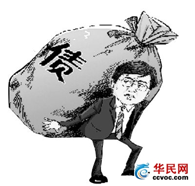
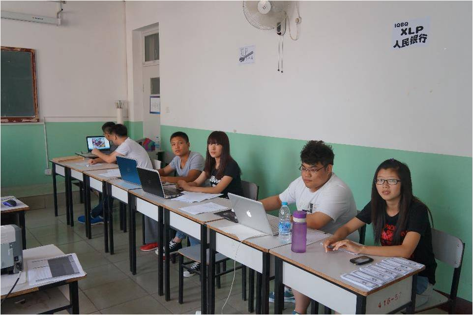

## 银行

货币发行

银行负责印刷并发行货币，会给每个小组开一个银行的户头，在各小组的账户内会有初始资金。每组由财务总监来办理各组的银行卡及银行一切业务。

存款

如果手头有多余的资金，可以将钱存入银行，获得一定的利息。存款分为活期存款与定期存款，利率与详细规则不太一样，具体情况还要由CFO慎重考虑。

贷款

若是支出过多导致资金紧缺，还可以找银行申请贷款。任务方要是有可以做抵押的产品或是材料就可以申请担保贷款，这样利率要低一些。要是实在没有可以做抵押的物件或是专利，还可以用个人信誉进行担保，只是这样利率高，时限短且每人只能担保一次。

贷款后需在法律规定时限内将贷款连本带息换完，否则你只能与银行在法庭上见。法院会强制你还钱，要不然就只能破产了。

拓展业务

银行还会发展很多丰富多彩的副业，比如彩票、理财等等。如果花时间好好研究银行的各种副业，或许能从其中狠赚一笔。

▲2014年天津机电职业技术学院XLP活动挑战方担任银行等角色

