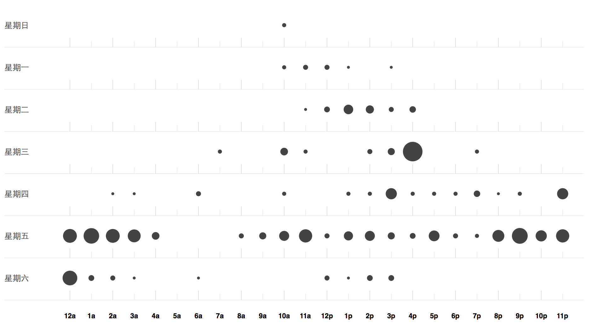

## 数据展示

* 来自各个行业的100余名学员，在60小时的极限学习课程内初步掌握Git分布式工具，并使用Git工具进行群体图书创作。难能可贵的是，在参加XLP之前接触过Git工具的学生仅占到10%左右的比例。

* 由以上进度对比表不难看出，前期使用Git工具进行分布式文档撰写工作，我们前期的进度是略超出预期的，但是在最后的Gitcafe网站的合并和发布阶段，由于各小组间存在调整Gitbook主体目录的情况，出现了较多的合并冲突，造成我们的进度极度放缓。这是我们存在的流程和权限控制缺陷，是值得深思的问题，分布式文档的撰写必须控制主干标题的更改。

* 从图片中反应出学员较好地应用了内部法庭的作用，产生了多种法律合同和纠纷，很好地与场内法庭进行了互动。

* 图中集中反映了从周三任务开始到周六，GitCafe网站的成功提交次数，可以发现随着时间的推移，团队成员对Git的掌握熟练度逐渐提高。

* 图中集中反映了从周三任务开始到周六，GitCafe网站提交的密集度，可以发现随着任务的推进，团队成员逐渐提高向GitCafe网站传输信息的频率。

