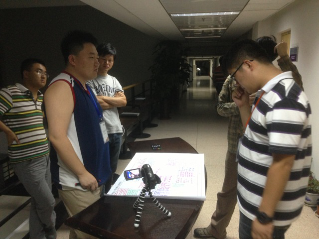
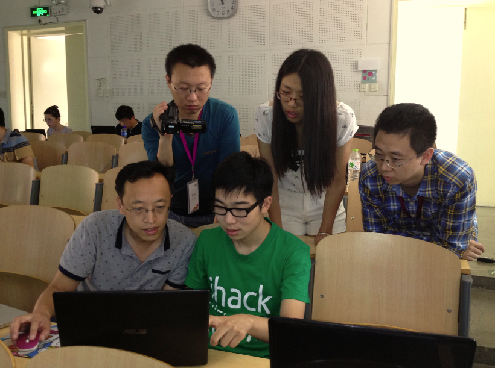
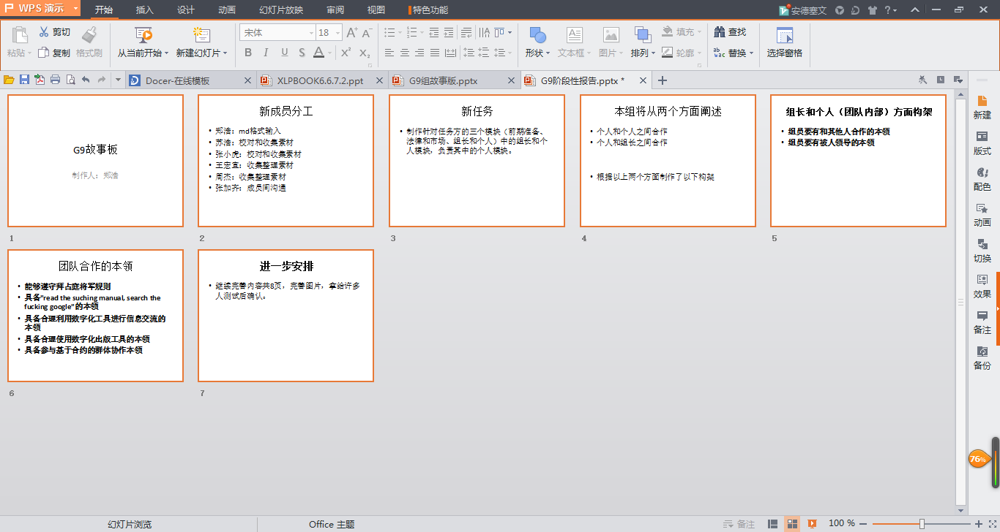

## 现场执行的四个阶段

* Early Success
	* 团队破冰
	* 初尝甜头，提高兴趣
	* Git Game
 	* 2014MEM第九组在进行gitgame，团队每个成员熟练掌握git工具，是XLS任务完成的基本保障。耗时如图
 	* 
 	* > 图片来源于2014MEM第九组成员郑浩
	* 635头脑风暴。  6个人，5个格子，转3圈，就能形成数十个idea。很神奇吧！
 	* 2014MEM第九组进行635头脑风暴成果展示
 	* 
 	* > 图片来源于2014MEM第九组成员郑浩
 	* 一些课余活动
  	* 2014MEM清华大学卢达荣老师带领学生参观清华大学实验室
  	* 
  	* > 图片来源于2014MEM第九组成员郑浩
	* 根据接领的任务订立团队合约
* Fail Early Fail Safe
  * 面对挫折，尽早矫正
	 * 你对项目的理解有可能简单，你对项目进程的难度估计可能不足，这个时候你才发现，为时已晚。
	 * 你对项目的目标有可能偏颇。及时修订团队目标，发挥团队力量，目标错了比不努力更可怕。
  * 点评团队合约

	 * 强大的点评团提升大家理解的高度——讲故事
	 * 
	 *  > 往次活动的亲历者在进行讲解
	 (图片由2014年清华MEM-XLP课程苏浩提供)

	 * 优秀的点评人告诉大家定位的方向(图片由2014年清华MEM-XLP课程苏浩提供

	 * 

	 * > 清华大学顾学雍老师在进行指导
     * 修正团队合约

	 * 在新的理解中，你的团队合约要调整吗
	 * 在新的目标中，你的团队合约有效力吗
  * 项目开发
   * 这些都将是你未来几天的武器
	 * 第一步   知识共享（CC）耗时30分钟

     * 保障自己的版权，让你的知识能够共享
     * 

     * 第二步   Teambition    耗时1.5小时
     * 项目管理应用，用于发布任务、查看进度及相关文档的存储
     * 

     * 第三步   toyhouse      耗时1小时
     * 用博客和回复来记录你学习中的每一刻
     * 

     * 第四步   GIT软件       耗时3小时
     * 分布式版本控制系统，可用于共享、修改文件
     * 

     * 第五步   比特币的使用  耗时30分钟
     * 虚拟货币，用于过程中的所有交易
     * 

     * 这些都将是你未来几天的武器

	* 挑战方向任务方发布突发事件
     * 面对突然事件，你颤抖了吗
* Convergence
	* 系统整合，群体协作。你需要和你的团队一起，有效分工，整合各种资源，发挥团队作战力量。
	* 
	* > CC-BY-NC-2014MEM第九组成员苏浩
	* 团队间协作。和其他团队进行团队间合作，共享有效资源。
	* 
	* > CC-BY-NC-2014MEM第九组成员周杰
	* 内容相互引用。这个阶段需要大量资料，你可以去官办市场购买，也可以在黑市交易（偷偷地哦）。请注意，你有可能会涉及侵权纠纷，别着急，有法院和律师可以帮助你，不过要花费一定的比特币。
	* 
	* > CC-BY-NC-2014MEM第九组成员周杰
	* 
	* > CC-BY-NC-2014MEM第九组成员张加齐
	* 图片仅为示意图
	* 准备展示材料。运用653头脑风暴（其他方法也鼓励尝试）集成团队每个人的idea，每天进行两次故事板汇报，向老师和同学们展示你们团队的工作成果，得到老师和同学们的点评和帮助。
	* 
	* > CC-BY-NC-2014MEM第九组成员张加齐

* Demonstration
	* 编辑书稿。根据汇报会形成的目录和前期收集的资料，分解章节编辑书稿，你可能要熬灯夜战了，这个时候你可能会遇到各种技术问题。别着急，寻求技术部门帮助。

    * 校对排版。书稿文字部分编辑完成后，XLP任务可能已经到了最后的攻坚阶段，充分地发扬你的创造力吧，为了制作一本精美的图册。小心书中的错别字会影响整篇书稿的质量哦。

    * 成果发布。筹备发布会是项非常复杂的工作，想想电影发布会前的准备工作吧。你可能会在众多重量级嘉宾面前分享成功的喜悦，你的心得体会是什么呢？

