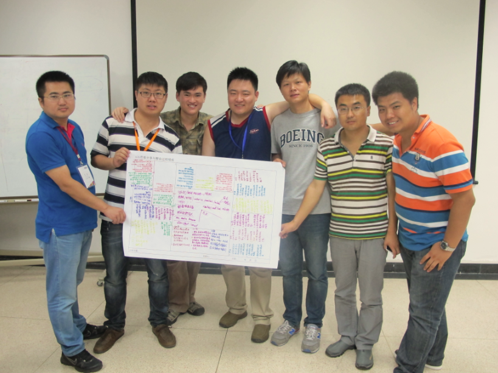
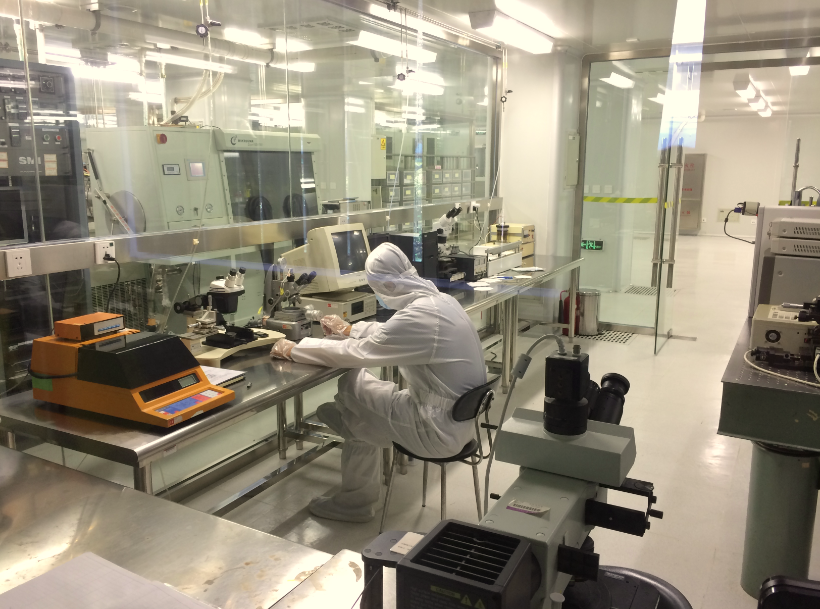

## 现场执行的四个阶段

* Early Success
	* 团队破冰
	* 初尝甜头，提高兴趣
	* Git Game
 	* 2014MEM第九组在进行gitgame，耗时如图
 	* 
 	* > 图片来源于2014MEM第九组成员郑浩
	* 635头脑风暴
 	* 2014MEM第九组进行635头脑风暴成果展示
 	* 
 	* > 图片来源于2014MEM第九组成员郑浩
 	* 一些课余活动
  	* 2014MEM清华大学卢达荣老师带领学生参观清华大学实验室
  	* 
  	* > 图片来源于2014MEM第九组成员郑浩
	* 根据接领的任务订立团队合约
* Fail Early Fail Safe
	* 面对挫折，尽早矫正。
	* 点评团队合约
	* 修正团队合约
	* 项目开发
	* 挑战方向任务方发布突发事件
* Convergence
	* 系统整合，群体协作
	* 团队间协作
	* 内容相互引用
	* 准备展示材料
* Demonstration
	* 在整个成果校对无误后，排版整理并发表内容，撰写心得体会，制作文字及视频成品，为发布做准备。
	* 我们可以对成果进行一次预演，以保证最终展示的完美性。
	* 最后进行我们进行最终的成果的发布展示，包括数字出版物、微电影、视频等形式。

#GitGame实践和心得

