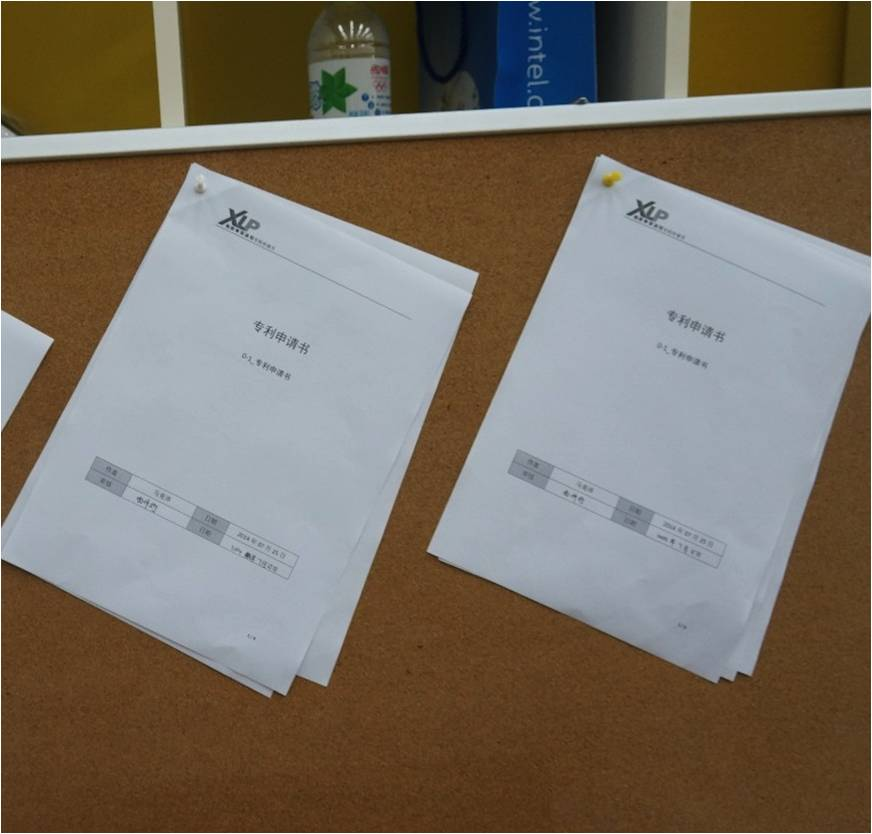
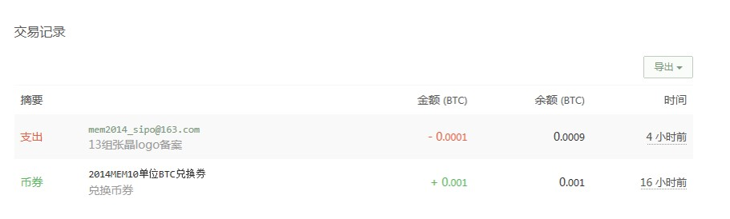
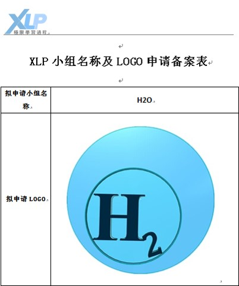
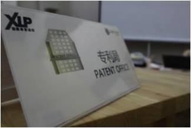

## 知识产权管理

在XLP活动中，专利局用来注册专利。研发出一个新项目，或是设计一个新外形都可以申请专利，但要经过一定的程序并缴纳一定的费用。申请专利需要手续，在后文中会给大家提供一个专利申请的模板。在你申请完专利后，如果你的专利获得了他人的认可，那么恭喜了，他将会付给你大量的资金来购买你的专利，你可以用这笔钱进行下一步的程序及硬件开发。
其实你还可以把对方组的你认为有价值的成果在对方未申请专利的情况下申请专利，迫使对方组不得不用巨额资金从你手中买下专利，以此获得对方资产，这样就用专利局获得了大量的资金。当然，建议同学们不要轻易尝试这个机智的方法，因为如果对方组在你之前申请了专利而并没被你发现，你再去尝试这个方法就会被告上法庭。

如果任务组们没有意识到以上方法，可以用小计谋提醒一下他们，比如黑市在第二天注册了我们组要做的项目的专利，把我们搞得焦头烂额。但这也提醒了我们专利局原来可以这么用

以2014级MEM H2O组将本组Logo注册了专利，如果之后其他组别或者媒体需要引用到此Logo，需要经过本组授权，避免产权纠纷。

▲2014年7月清华附中XLP活动

这为学生运用现场策略性阻断别人进步以保证自己获得胜利提供了一种手段，但是申请成功后，还有可能被别人侵权，这时就体现了学生处理这样事态的能力。
