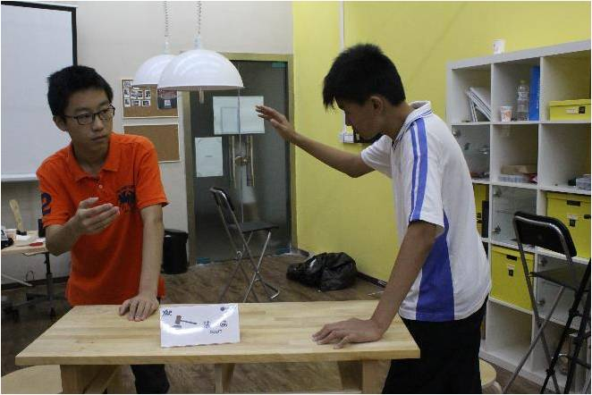

## 法律及冲突调解

法院负责调解XLP活动中产生的各种纠纷。挑战方和任务方均可向法院提起诉讼，受理时间为9:00——18:00。法庭遵循公开、公正、公平原则，一切按法庭流程办事。开庭时双方当事人、律师及证人都需在场，在得到开庭通知后无故不出庭的原告和被告会由法院人员紧急传唤，若紧急传唤后仍不出现则定为败诉。庭上双方不得使用侮辱性词语，第一次警告，第二次惩戒（罚一定资金给对方，再犯翻倍），情况严重者直接败诉。每次有一定的开庭费用，由败诉方承担。若双方在开庭后决定调解，则共同承担诉讼费用。
比如在活动中有人盗取专利，或是违规操作，你都可以将他们送上法庭，只要理由充分，证据确凿，不仅可以免去诉讼费用，还可以获得一笔赔偿。在法庭上千万不要抱有任何侥幸心理，因为在这里，一切都是用事实在说话。

▲2014年6月天津机电职业技术学院XLP活动挑战方担任法院角色

在活动开展过程中不可避免的会出现冲突和纠纷，而法院正是为解决各组纠纷、保护各组权利不受侵犯并提供一种获取资金的“特殊渠道”。挑战方在现场设置法律诉讼的标准流程，让学生们经过公开的程序，解决冲突，同时可以用来判断个人或群体对权责的分配、技术的内涵或价值，是否有合理的认知。并且可以经由案例发生的频率与内容，分析出该学习活动是否达到活动的设计目标。在XLP活动开展之初，任务方的成员一般是出于迷茫阶段的。对法院、维权、诉讼是没有任何概念的，更不会按挑战方初期设定的流程实现法院此功能。所以就必须有挑战方用相应的办法来引导、刺激任务方，去了解、运用法律的手段来维护自身权益同时推动法院的运行。

▲2014年8月清华附中XLP活动任务方在法院开庭环节进行辩论
