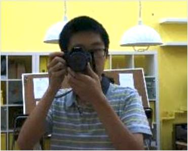
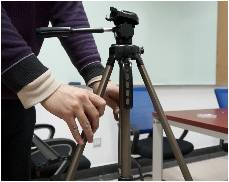

## 媒体及传播

活动的汇报演示中，照片和视频将会占据PPT的很大一部分内容，因此活动过程中随时记录发生的点点滴滴便显得尤为重要。媒体记录员需要在任何时间任何地点，随时准备好端起DV或相机，记录日常的点点滴滴。

* 挑选照片视频
	*  在拍摄完照片视频后不能未经挑选和处理直接堆到PPT上，而需要精细地整理筛选，最终得以整合到PPT上或交给后期制作人。
* 整理
	* 照片视频需分类保存到电脑里，常见分类有时间（如日期）、活动（如讨论活动、搭建活动）及部门（如与银行交涉、法院开庭等）。需按分类将照片视频存入相应文件夹。重命文件名可以为后期制作省去大量整合工作，如“银行-0731”,“项目搭建-0726”，这里我们的格式为“相关内容-日期”。
* 筛选
	* 媒体记录员需要在认真整理后依据PPT所需相应内容筛选图片视频，如PPT标题为“挑战方”，则需要挑选有挑战方部门名称塑料牌的图片或挑战方人员的合影。

▲2014年7月清华附中XLP活动

▲2013年1月清华大学跨学科系统集成设计挑战XLP
