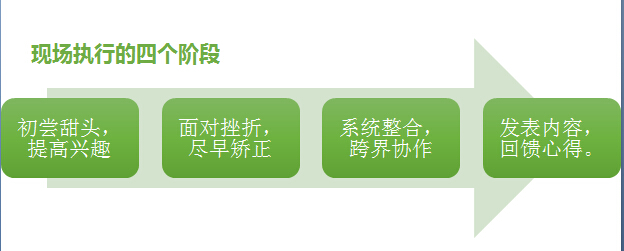
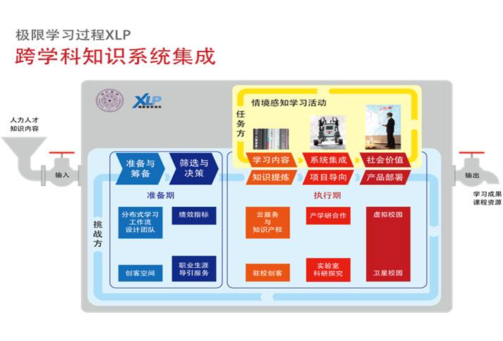

## 本章导引

这四个阶段，必须与上述 “契约式设计”的教学内容，以及基于Git的数字化工作流平台融合为一体。关键问题是，如何把Git这个专为软件开发所设计的工具，介绍给一群从来没有软件开发经验的人群。而这一问题的现实意义是，没有Git的标准化信息分享机制，各种任务派遣的合约内容、参与者的身份记录以及整体数据的搜集与统计，就会变成一个难以跨越的巨大的数据管理障碍。

# 任务方基于Git进行XLP具体实践

*
XLP是一种分布式学习工作流，概念是将工作分布到多个枝节，每一个枝节都可以不考虑其他接口高效并行，最终输出统一的成果。

*
例如，一个一百余人的团队作为任务方，要根据一份凌乱无序的粗糙文档，完成一本数字化输出的完整的高质量的操作手册，并进行商业化发布。同时，任务方处于一个微缩型的真实社会环境中，在整个作业流程中，需要考虑银行、法院、市场、媒体以及政府管理部门等各个影响因素。操作手册以及在作业过程中的影像记录、各种文件记录和媒体发布等，都可视为最终的成果。任务方按照结果导向型思维，根据对此结果的分析和定义，得出完整的工作范围和质量要求。

*
任务方为了完成任务，分为19个小组，每一个小组7名成员，具有一个小的分布式的作业系统，即具备财务、法务、公关等完备的职能。每个小组乃至每个成员都可以在Gitcafe上领取到一份操作手册草稿，按照工作范围和质量要求，在此手册草稿基础上，按照各人的职能进行修订，完成之后上传至Gitcafe，每个人所做的工作在Gitcafe上面都有清晰的展示，互相之间有冲突的、重复的、相似的地方，可以通过Merge（融合）进行选择合并。同理，负责拍摄影像记录的小组、负责媒体发布的小组，都可以并行工作并上传至Gitcafe进行合并。

*
这种分布式工作流的优势在于，每个工作小组的成员都可以发挥主观能动性，不必等待清晰的指令，也不必担心工作的接口问题。在这本操作手册中，小组内的财务负责人可以写入如何管理小组资产，如何与银行、市场进行交易行为以达到优化成本和开源节流的目标；法律负责人也可以写入如何保护知识产权和防止侵权以避免收益损失；公关负责人也可以写入如何与媒体互动、举办媒体发布会等活动以扩大商业影响。
在作业流程中的各种记录文件，例如因侵犯知识产权而产生的法律诉讼文书、因市场买卖行为而产生的合同协议、为了举行媒体发布会而产生的策划文件等，都可以作为证据性的产出，融合到操作手册中。

*
在分布式工作流的时代，人们不会再按照传统的工作方式，被动的等待指令，而是主动进行创作，寻求合作。Git是这种工作模式下的基本数字化工具。Git在提高工作效率的同时，还可以清晰量化每个人的工作贡献，同时保护每个人的知识产权不被侵犯。
