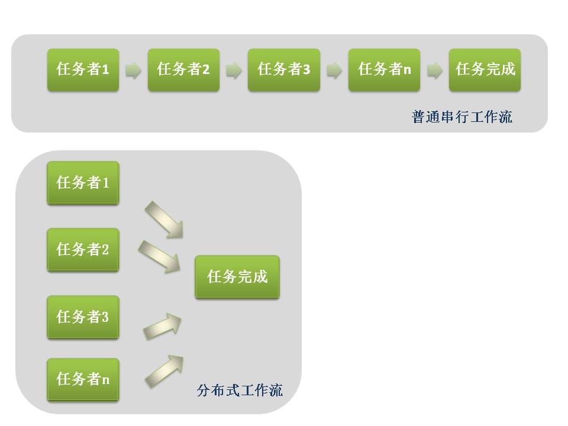

## 本章指引

XLP是一种分布式学习工作流，概念是将工作分布到多个枝节，每一个枝节都可以不考虑其他接口高效并行，最终输出统一的成果。

每个枝节都是一个小的分布式作业系统，所以任务方的每个小组里面都应有自己的组长、财务、公关、法律顾问等，然后每个人理论上可以身兼数职，如果全部人都被枪毙仅剩一个，那个人将既是法务，又是财务，既是公关，又是技术员。所有任务方的小团队都是一个小的具体而微的完整小型社会。然后这个完整的社会又可跟其他小组，甚至跟挑战方的小组组成一个大的无限多的微型社会，这是一个一层一层迭代式的小的微型社会，因为分布式的系统都必须要有管理的成本，每个人都不应该等待其他人的指令来做事，因为这样就不能叫做以学习者为出发点的学习活动的本质，所以一开始每个小任务方的分工就应该从组长、法官、法务部、公关等方面来展开。其实每一个小的任务组都具有完备的功能，他能替自己的小组写预算，打官司，替自己以一个法人的身份设立一个小的完整组织，这个组织有一些基本功能。然后每一项工作的人员都有自己的标准工具。比如说财务人员要有一个得益平衡表和一个财务预算表，然后法务部要有几个标准文件及相应的一些文档并且知道怎么签署协议，这是它的功能技术。每个团队都有自己的Digital Librarian。

为什么使用XPL和分布式价值流来安排任务组的任务：
>* 可以加快阶段性学习成果展现的速度
>* 可以保证搜集学习记录的规律性
>* 有助于学生掌握一种系统全局的意识

*(引自<分布式学习工作流：融合信息技术与实体校园的操作系统>, 顾学雍，王德宇 ，周硕彦，杨富方，卢达溶）*

例如，一个一百余人的团队作为任务方，要根据一份凌乱无序的粗糙文档，完成一本数字化输出的、完整的、高质量的操作手册，并进行商业化发布。同时，任务方处于一个微缩型的真实社会环境中，在整个作业流程中，需要考虑银行、法院、市场、媒体以及政府管理部门等各个影响因素，操作手册以及在作业过程中的影像记录、各种文件记录和媒体发布等都可视为最终的成果。任务方按照结果导向型思维，根据对此结果的分析和定义得出完整的工作范围和质量要求。
    任务方为了完成任务，分为19个小组，每一个小组7名成员，具有一个小的分布式的作业系统，即具备财务、法务、公关等完备的职能。每个小组乃至每个成员都可以在Gitcafe上领取到一份操作手册草稿，按照工作范围和质量要求，在此手册草稿基础上，按照各人的职能进行修订，完成之后上传至 Gitcafe，每个人所做的工作在Gitcafe上面都有清晰的展示，互相之间有冲突的、重复的、相似的地方，可以通过Merge（融合）进行选择合并。同理，负责拍摄影像记录的小组、负责媒体发布的小组，都可以并行工作并上传至Gitcafe进行合并。
    这种分布式工作流的优势在于，每个工作小组的成员都可以发挥主观能动性，不必等待清晰的指令，也不必担心工作的接口问题。在这本操作手册中，小组内 的财务负责人可以写入如何管理小组资产，如何与银行、市场进行交易行为以达到优化成本和开源节流的目标；法律负责人也可以写入如何保护知识产权和防止侵权以避免收益损失；公关负责人也可以写入如何与媒体互动、举办媒体发布会等活动以扩大商业影响。
    在作业流程中的各种记录文件，例如因侵犯知识产权而产生的法律诉讼文书、因市场买卖行为而产生的合同协议、为了举行媒体发布会而产生的策划文件等，都可以作为证据性的产出，融合到操作手册中。
    任务方通过git平台，采取迭代式开发工作方式，将终极任务分解，每次被派遣的任务都可以看作小任务。任务方通过做一个个小任务，在每次迭代中完成终极任务的一部份功能，最终实现了原本看起来根本可能完成的终极任务。
