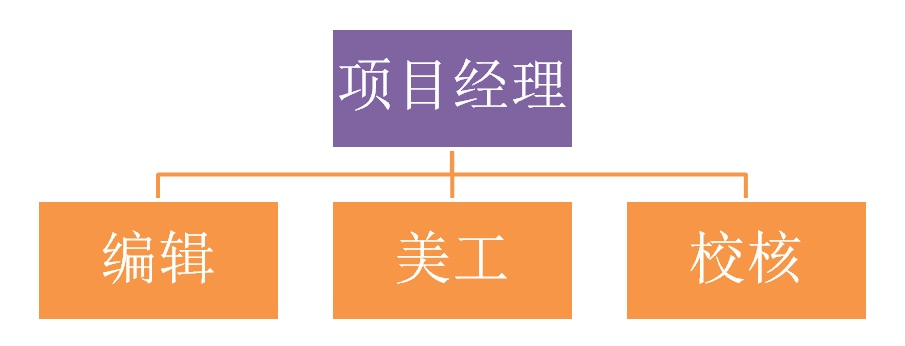

## 任务方分工

###任务的接收方首先要根据任务的性质组建项目团队，实际任务的性质不同，小组成员的内部分工也不相同，比如本次数字化出版物 --《xlp操作手册》，各任务小组的内部人员分工如下图：

+ ###公关总监
    + 负责外交与宣传。在与其他团队或挑战方成员间产生冲突时，需要外交官进行调解协议。
    + 你需要在与对方交流的时候为自己的团队争取最大的利益。明白怎样说服别人，才能赢得机会。在达成一致协议后，需要填写“合作协议”。同时，需要完成团队产品的推广方案设计。所有文件上传至Teambition或是Git。
    + 口才能力强，心思缜密且思维敏捷的同学适合担任这个职业。

+ ###技术总监
	+ 技术总监分为软件技术人员（负责编程）和硬件技术人员（负责搭建），负责专心在有限的时间内最高效地完成任务。
	+ 听从CEO的任务安排，并将任务进度实时汇报给CEO，向CEO提供所有任务完成信息。负责组内所有设计任务（如logo和组名设计），以及微电影的制作。
	+ 由“技术宅”来担任，也可以由其他职务的同学在能力范围内兼任。

+ ###法务总监
	+ 在XLP中设置有法院部门，因此需要法律顾问为团队辩护。并且负责专利申请，和向法院进行侵权告诉。
	+ 你需要为自己团队的专利进行申请和维权，填写“专利申请书”等文件并上交至专利局进行申请。在被起诉时，你需要按时地接收法院的起诉书，及时前往法院进行法庭辩护，为自己的团队争取最大的利益。在其他团队或挑战方成员对你们团队构成侵权行为（如偷窃或侵犯专利等）时，你需要在法庭起诉他们，利用法律手段维护自身权益。所有文件按时上传至Teambition或是Git。
	+ 口才能力强且思维敏捷的同学是很好的人选

+ ###财务管理
	+ 管理团队内所有的财政事务，包括市场、知识产权、银行等交易。合理地分配你们有限的资金是CFO的责任，有时甚至需要进行价格的砍价协商。
	+ 你需要去进行市场采购、银行理财，统计每天的支出、余额，并制作预算和决算表，实时上传至Teambition或是Git。
	+ 适合交流、理财能力兼备，心思精明的同学担任。

