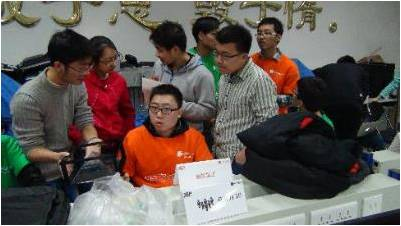
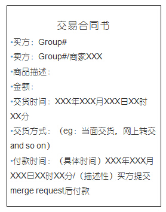
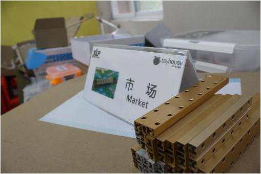
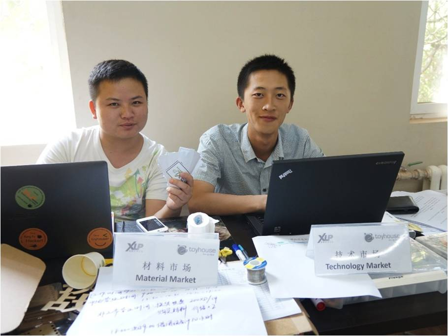

## 市场：技术市场

技术市场出售技术，这里既有软件编程技术性人才，又有硬件搭建技术性人才。如果有任何技术上的问题，可以花费虚拟货币向我们的技术人员提问，按小时计费，不论你有什么关于技术方面的问题，都可以向技术市场请求帮助。他们会给你讲解，直到你学会为止。虽然有时技术市场得不到太多重视，但是当你面对一行行代码而头疼，或是对硬件搭建不熟悉时，技术市场会帮上你大忙。

▲2014年1月清华大学跨学科系统集成设计挑战XLP现场，挑战方团队通过技术市场，为任务方提供数控加工服务

## 市场交易流程及合同模板

C2C交易程序  
商家代表或市场总监获取权限  
求购消息发布/出售消息发布  
买卖双方通过issue接洽  
买卖双方交易进行并提交“交易合同书”  
卖方接收虚拟货币/买方接收商品同时提交merge request  

各Group可查询账目记录  

##  市场：材料市场

材料市场是一个购买所有所需材料（除电脑外）的场所。同时也是整个XLP活动中最重要也是与任务方接触最多的角色，所有你所需要的东西大部分都来自于此。这里要比黑市正规，价位比较合理，运气好的话会遇上打折和甩卖。不过从里面购买任何物品都需要签合同，只有合同让双方同意时才能有效完成交易。在购买之前CFO需要提前规划并统计购买的物品数量和总钱数，也要拟定合同，这可要辛苦各位CFO了。材料市场会在每天早上进货，采购者可以进行查看（有时候会有帮助，前任任务方曾一次避免了一个危机）。要是资金充裕的话，还可以垄断市场上的某种重要材料，再高价抛售出去。不要妄想自己带材料而不在材料市场购买，那样你将会被告上法庭并极有可能赔偿一笔不小的费用。

▲2014年7月清华附中“智能空间”主题XLP活动现场挑战方开设的材料市场

一切都需要在材料市场购买  
所以一定要提前准备齐所需的材料

>详细规定，购买清单及合同模板见附录
