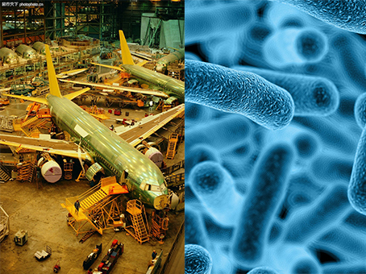

# 挑战

如果你是一名航空工程师，梦想过自己成为在国产大飞机研制生产过程中，协同所有供应商及生产基地的一份子吗？如果你是一名医生，看到埃博拉病毒在非洲大地上肆孽的新闻时，畅想过协同全球不同课题组，与自己共同研制埃博拉病毒疫苗吗？

在知识爆炸的今天，人们不再担忧获取知识的渠道，但对高难度科学技术的群体应用和分享正逐渐成为人们应用与分享知识中的最大瓶颈。因此，很多人对上述问题的第一反应都是不可能，是一个疯狂的想法。

但是，我们想说，在一定的资源条件下，通过合理的资源配置和协同，实现上述目标绝对不是天方夜谈。我们认为，基于信息资源共享，在先进的群体学习与知识共享的方法论指导下，各学科、各专业背景成员有效协同的学习以及项目运作，就是解决在互联网时代，解决信息爆炸与知识群体学习及应用矛盾的金钥匙。
