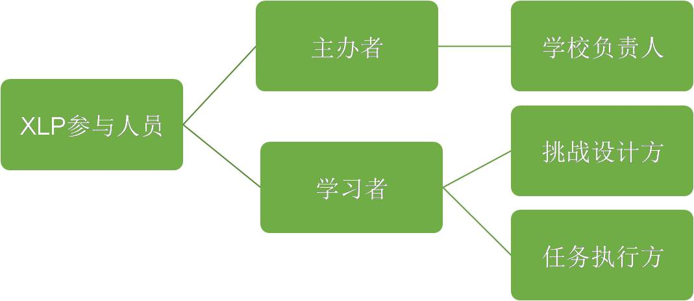
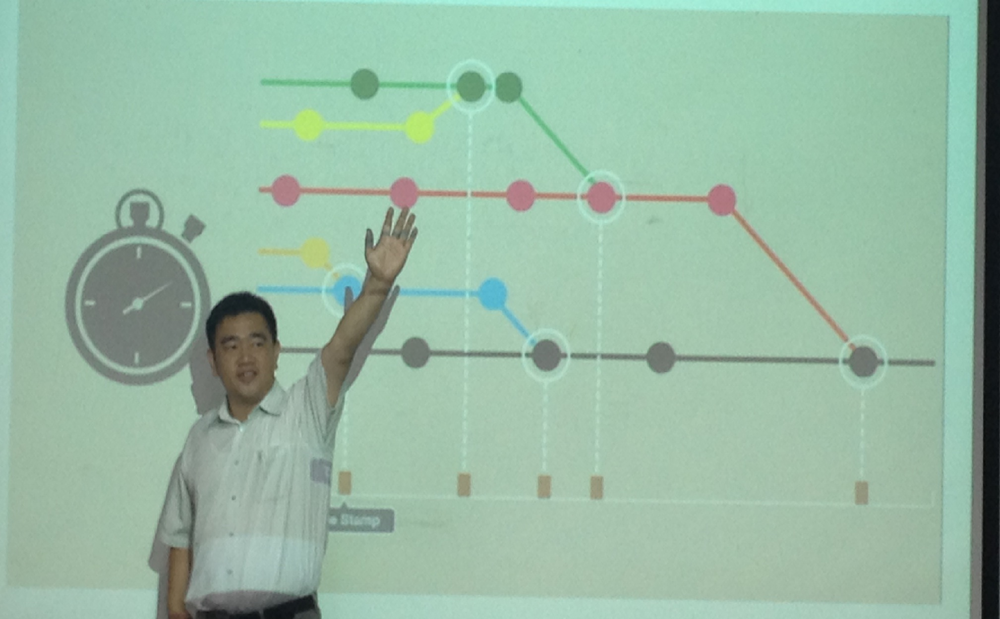

##XLP的组成架构

XLP的参与人员包括主办者和学习者， 学习者中可分为两种角色：挑战方和任务方。

* **主办方**

  主办方负责提供场地、材料等活动必须用到的物品，但不需亲自参与活动。所有的XLP的活动就像组织一个完整的学校，他有学校的组织者也就是学校的领导以及他的行政人员来召集参与学习活动的人，以及对参与活动的人提供行政财务以及物品方面和技术方面的各种资源。

* **挑战方**

  挑战方执行时会分数个部门（市场、专利局、法院等）以模拟真实的社会环境，同时也是规则的制定者，可以在现有条例上添加额外的条例。他们为任务方提供活动任务，并引导任务方完成任务。当然，他们还需根据现场实际进程快慢调整难度高低以控制任务完成数量与质量。

* **任务方**

  任务方分为数个小组，类似于创业初期公司的团体。组员经过相互熟悉、选定目标、分配任务、制作项目的步骤，体会到创业的艰辛、社会竞争的残酷以及团结协作的重要性。。

