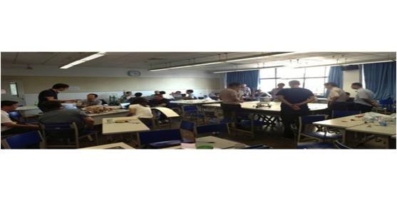
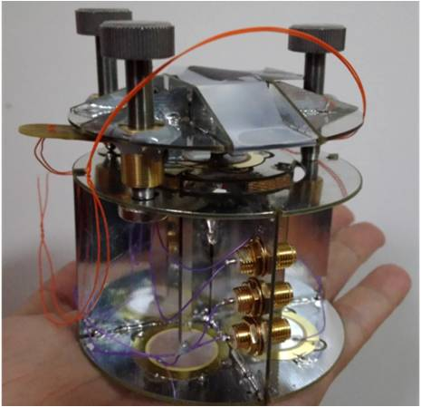

# 故事
在互联网,物联网高度发达的今天,需要什么样的人
,什么样的学习和工作方式才能适应当今社会的需求,什么样的组织架构可以保证项目执行的高效？通过如下几个事例或许我们会得到一些答案：

* 清华首届MEM事例展示

2012年8月，由跨院校、跨专业、多年龄层团队的20-30人构成的挑战方以及清华大学首届76名工程管理硕士参加了为期4天的极限学习活动,通过每天固定时间的全面进度检查和经验交流，同时运用云技术建立日常信息交换通道，保证学习团队内部与学习团队之间的持续信息沟通，课程最后搭建了一套自动化的转运系统，包括物联网、自动导向车辆等，并整合为了完整的产品，通过制作商业计划并成功地向模拟投资人筹款,最终达到了课程目标。

* 清华附属中学事例展示

2014年1月由台湾中研院胡恩德教授指导，16名清华附中初中学生参加了一次跨学科系统集成设计挑战“我的空间我做主”的极限学习主题活动。目的是通过群体协作在规定时间内制造出一套低成本原子力显微镜。这个貌似不可能完成的任务,却如期完成,并且使用DVD读写头等低价元器件，实现了价值上百万美元原子力显微镜的功能。

正如一名参加了主题活动的清华大学附中学生吕松天所言：

在这几天的极限学习过程中，我收获了许多，这是一种我从未体验过的学习模式 ，在团队的分工合作中，我学到的不仅是硬件的搭设与编程，更学到了如何与组员相处融洽和如何做到各尽其能的完美配合。挑战方给我们提供的工作环境犹如一个真实的社会，有市场、法院、专利局••••••这更是让我们了解到了创业初期一个企业该如何运作，为我们将来创业成功打下了基础。

我们可以从中得出一个结论:不管是成年人，还是心智水平不够成熟的学生，无论人数多还是少，都可以借助数字化的群体学习方法论，通过基于分布式的数据集成系统，能够在实践中产生我们之前所不敢想象的结果。这个极限学习过程就是XLP。
