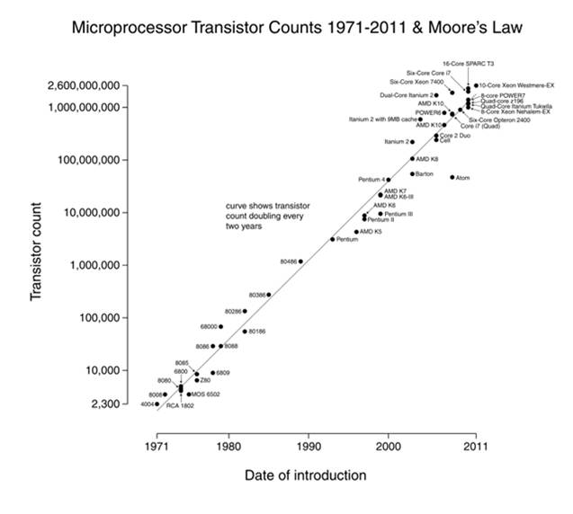
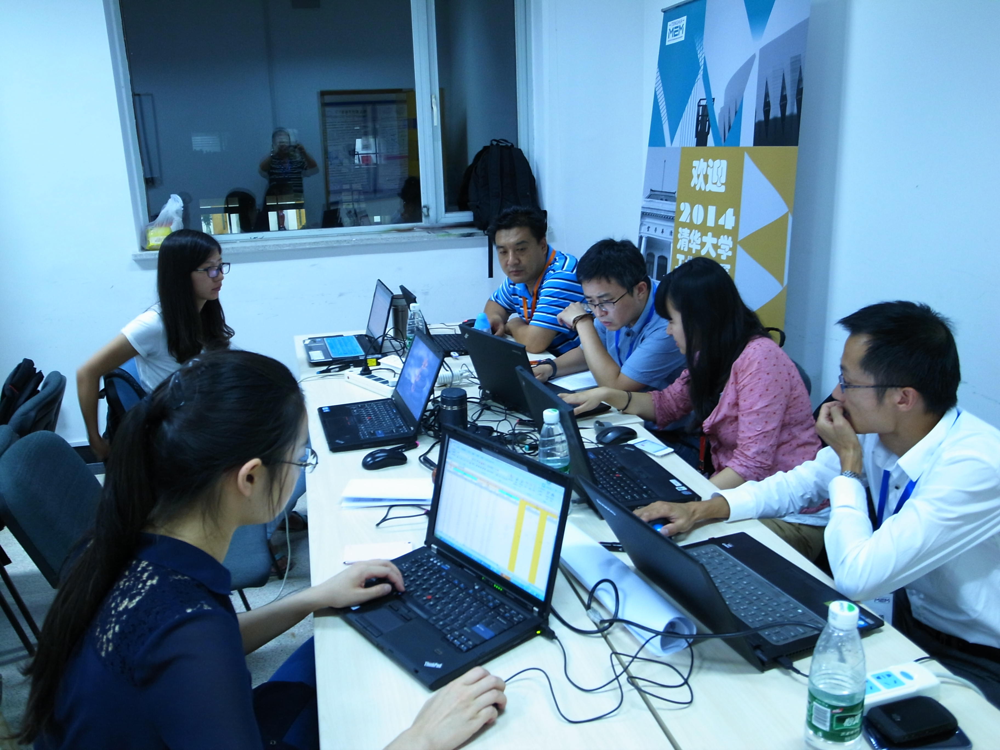
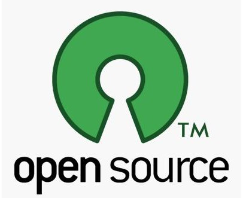

##WHY XLP
Xlp是数字化的群体学习的活动设计方法论，用现代最先进的分布式的作业系统、项目管理、版本管理的控制器，来帮助我们处理大量数据的集成与协作，在这样的平台下，我们可以使用大量的数据，让人数众多的团队共同做一件事情，所以他同时也是一种管理支持的工作方法论、管理支持的平台。我们还有精确的数据采集平台用于精确地采集个人和团队的精确数据以及筛选各种不同专业人员心理及行为的数据。
Xlp是全球唯一的把学生的人力资源整合在一起，让同学们真正意义上参与设计、运行及操作，整个学习过程进行设计与测试的人力资源调度方法。

###回应社会高速变化
极限学习过程是一个回应社会高速变化的群体学习方法。特别在网络与信息科技变革的推动之下，人群组织的结构、市场的需求、各种法令与社会冲突的演进、以及自媒体传播的深度与广度，已经根本性地改变了生活与学习需求的常态。知识的本质，因为网络化的信息传递与数字化协作的各种工具，让学习的内容与方法从以个人能力为主要的学习评判方式转移到了以团队产出为主的群体学习方式。而如何组建具有学习能力的团队，以及如何训练个人能够快速地适应并参与灵活重组的任务团队，就成为了现代教学组织的一个巨大挑战。

* 摩尔定律

 “当价格不变时，集成电路上可容纳的晶体管数目，约每隔18个月便会增加一倍，性能也将提升一倍。 ”
—— 英特尔创始人 戈登·摩尔（Gordon Moore）

▲单位面积微处理器晶体管数量及摩尔定律，由Wgsimon制图

该定律在过去半个世纪里保持了难以理解的准确性。一切都越来越快，但我们的学校与学习似乎是过去半个世纪里唯一改变不大的东西。

极限学习过程是一个回应社会高速变化的群体学习方法。特别在网络与信息科技变革的推动之下，人群组织的结构、市场的需求、各种法令与社会冲突的演进、以及自媒体传播的深度与广度，已经根本性地改变了生活与学习需求的常态。知识的本质因为网络化的信息传递与数字化协作的各种工具让学习的内容与方法从以个人能力为主要的学习评判方式转移到了以团队产出为主的群体学习方式。而如何组建具有学习能力的团队以及如何训练个人能够快速地适应并参与灵活重组的任务团队就成为了现代教学组织的一个巨大挑战。

             ▲2014年XLP活动小组讨论

传统学习过程的常数型期望值，相对信息时代下社会效能的指数型增长，越来越显得落后于现实的需要。极限学习过程就是基于这些物联网时代、大数据时代的新需求，而设计的分布式学习工作流。我们依照分布式的信息架构，设计出信息积累与知识提炼的各种工作模版。我们也调度各种不同的专业人士，从社会需求，个人兴趣的角度，不断地从实验过程中修正对学习方法与学习活动设计的理念。在这个网络化知识资源，不断地以免费与开放的方式，呈现在不同地域与不同年龄层的学习场景中。

* 三人行必有我师

极限学习过程的存在基础，就是论语里所传颂的群体学习原则。这不是新的理念，而是一种根本的原则。今天，教与学的对象不再是固定的从教师到学生，而是一个由人与计算机网络结合而成的知识生态圈，学习者也是生产学习内容的教师。然而，现今的教学方法，由于教师工作的专业化，我们开始忘却学习的本质是以学生的能力提升为前提，而不是以教师的能力比较为前提。XLP提出的各种学习活动的组织方法，都是让所有参与者，同时当作学生，也当作学习行为的范本，不论是正面或是负面的行为都可能对其他同学由启发的作用。所以我们设计了“挑战设计方”与“任务执行方”两种学习参与者的角色。我们希望以这样的角色定义，来修正以教师个人为中心的教学责任制度。这个角色的定义，根本性地指出学校，也就是群体性的学习组织，不该以“教师治校”或“教授治校”为诉求，而是应该以“知识治校”、“能力提升”为治理学校的基础原则。这些考量，可以从学习过程所产生的过程数据、学习性项目所产生的阶段性产品、内容、服务质量来评断。这些数据的可信度，来自群体经年累月的累积，以及安全而透明化的信息管理方式。不论是学习角色的定位、学校资源的配置、以及学习过程数据的管理，到2014年为止，可以客观地说，绝大多数的学校都还没有发挥数字化群体学习的潜力。学校是一个群体学习的组织单位，她需要一套能够发挥当代技术与社会常态的运营方法论与支撑长期运营的技术平台，XLP就是针对这个社会与组织内部需求的一个探索项目。

###大数据时代的新需求
从1995年起，由于互联网的使用便利性和各种新的信息服务的飞迅速提升，让网络化内容，与很多传统的知识传递服务，如大规模的在线课程(MOOC)的新知识传递渠道，深度地冲击了学习的场所与知识内容的取得资格。经过专业教师长期消化整理的知识内容，在实体课堂空间一位难求的时代，只有经过重重关卡筛选过的人才，才能够享受这样的稀缺资源。但是互联网或是MOOC服务开放了这些知识传递的机制，稀缺资源成为了免费资源。学校的新机会就是如何让网络上对把已经开放给全社会的资源感兴趣的人士，能以各种渠道参与新知识的开发，进行对现有知识内容的修正工作。对于知识内容的展示、修正、多面向、针对特定群体的呈现，都是需要大量人力与物力的投入。学校必须开发一种新的人才组织方法，把各种知识内容与内容出版与编辑的人力，以网络化社会的组织方式，重新规划。从前，教师或教授是以个人为单位，“Publish or Persih”。而今天，我们可能利用网络化的社会群体运作机制，让一群自组织的参与者，利用类似 Wikipedia的使用者产生内容的工作方式，出版并演化知识内容。所以，XLP的设计，就是基于这样的分布式出版工作流的思维，组织各种跨学科的贡献者，传播一套适于普罗大众参加的知识提炼与出版的协作流程。

          ▲2014年XLP活动各小组讨论

  总之，XLP是一个以群体为单位的学习方法论、我们不能再期望以个人为单位的传统学习方式，能够满足社会与个人的需求。

* 开源化学习，一种正在形成的未来

学习，本应该也完全可以，更开放、更自由；不同的人可以协作、共同学习——这是一种正在形成的未来。世界各地的人正在对其进行各种尝试——如MOOC，Coursera，《第五项修炼》等等。
封闭孕育落后，开放产生进步——基于这个理解，我们选择XLP。

     ▲为节省成本，英国政府下令首选开源软件

