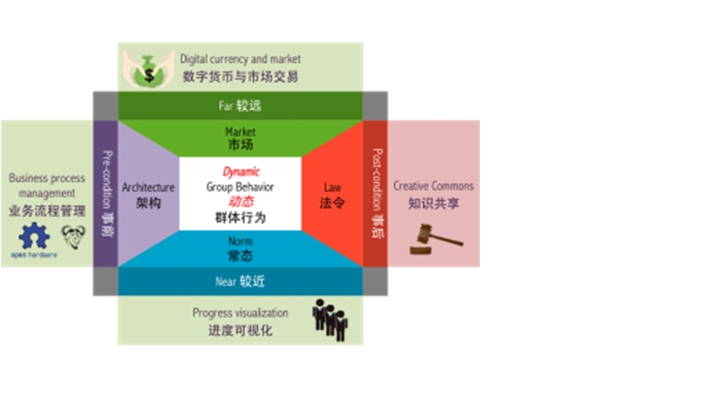

# 理论背景
群体行动和群体行为有什么区别？行为是没有意向性的，行动是具有意向性的，群体行动存在的必要条件是这个群体的所有个体具备一致的意向性。

Lawrence Lessig教授在其著作Code and other laws in cyberspace 中提出了一套四力的群体行为驱动模型，这四种驱动力，可适用于各种规模的群体。

+ 架构（前）
群体协作的操作支撑条件，这些条件创造了群体行为的可能性，例如开源软硬件技术、网络化的文件分享。在实际协作发生行为之前，制约群体的行为的先验条件。总而言之，架构可视为一切行为的前提背景，此背景涵盖一个社会系统的基础建设、人事组织、以及工作模式。

+ 法律（后）
基于群体之间的协议规范，在行为发生之后利用过程记录和证据对个体行为进行评价，以决定奖惩的措施。在实际协作发生行为之后，对群体之间的矛盾进行仲裁和调解。法律的力量往往需要不良行为发生之后才能显现出来，法律运行需要一个具有良好执行能力的机构作为保证。

+ 市场（远）
群体行为的价值导向，群众的交易行为反应他们对价值的动态判断。这些判断往往展现了人们对目前所欠缺的资源的需求，是对外部，或是远处的追求。

+ 常态（近）
群体行为也会受到同侪行为的影响。例如一个房间中的大多数人都在忙碌工作，个体也会倾向于遵守这一常态而努力工作；这种同侪压力，是来自近处的影响。常态“推动”是远比市场“邀请”更为强大的力量，它试图把个人“非常态”的行为引入正轨，不论个人本身是否愿意这样做。

XLP课程设计不只着眼于具体学科的技术内容，更将一个班级或院系的学生作为一个微型社会来看待，进而利用该社会提供的所有机会与潜在力量，创造一个学习型的互动环境，从而形成累积、传播、创造与运用知识的功能系统。
