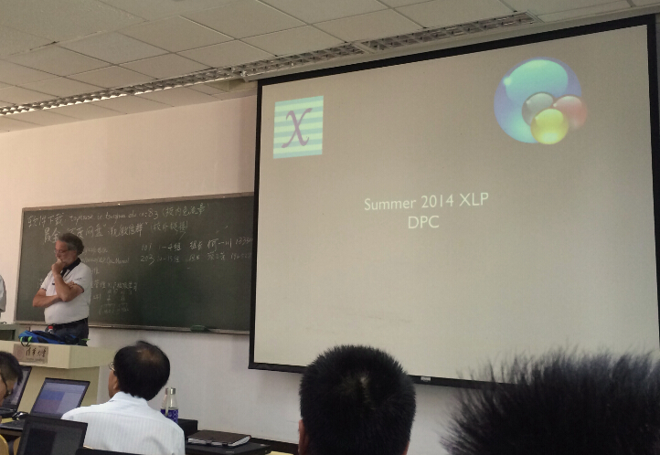
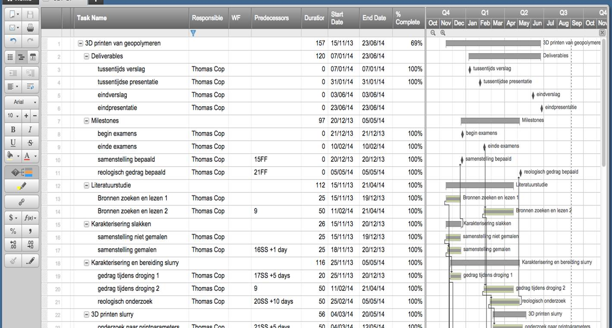
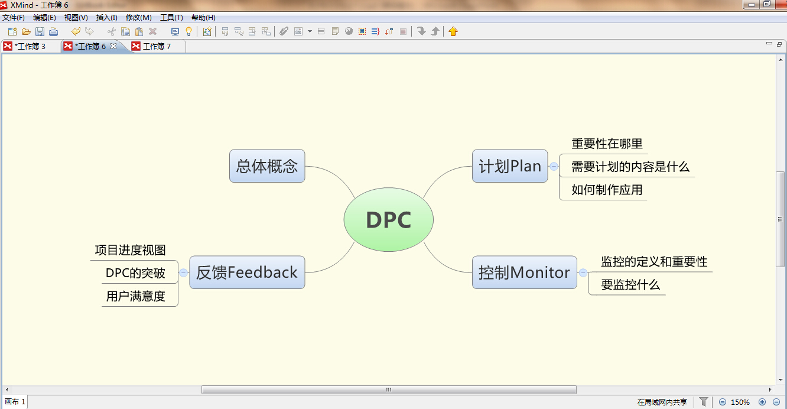

# 计划

##“计划”的重要性：

计划是DPC理念最为重要的起始点：

如果你没有计划要控制，那就不要计划
（If you don’t plan to monitor, don’t plan）

如果你做了失败的计划，那就等着失败（If you fail to plan, you plan to fail.）

如果你不打算控制，那就等着失败（If you don’t plan to monitor, you plan to fail）

##需要“计划”的内容：

1. 任务清单
2. 组织结构
3. 任务间的逻辑和联系
4. 持续时间
5. 权重

##"计划"制作的应用

通过Xmind等工具可以将项目的计划定义为任务树，对总目标进行分解，并通过teambition等将任务分发给各人：

