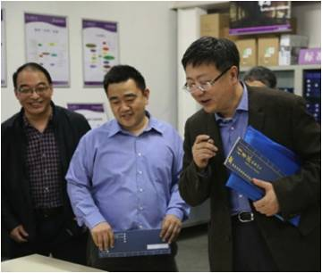

##主办者

* 主办方负责提供场地、材料等活动中必须用到的物品，但不需亲自参与活动。
所有的XLP的活动就像组织一个完整的学校，他有学校的组织者也就是学校的领导以及他的行政人员来召集参与学习活动的人，以及对参与活动的学生提供行政财务以及物品方面和技术方面的各种资源。

▲2014年3月 清华大学校长考察极限学习过程在清华“创意、创新、创业”活动中的应用。从左至右依次为：清华大学基础工业训练中心主任李双寿教授、Toyhouse工作室及XLP创始人顾学雍副教授，及清华大学校长陈吉宁教授
